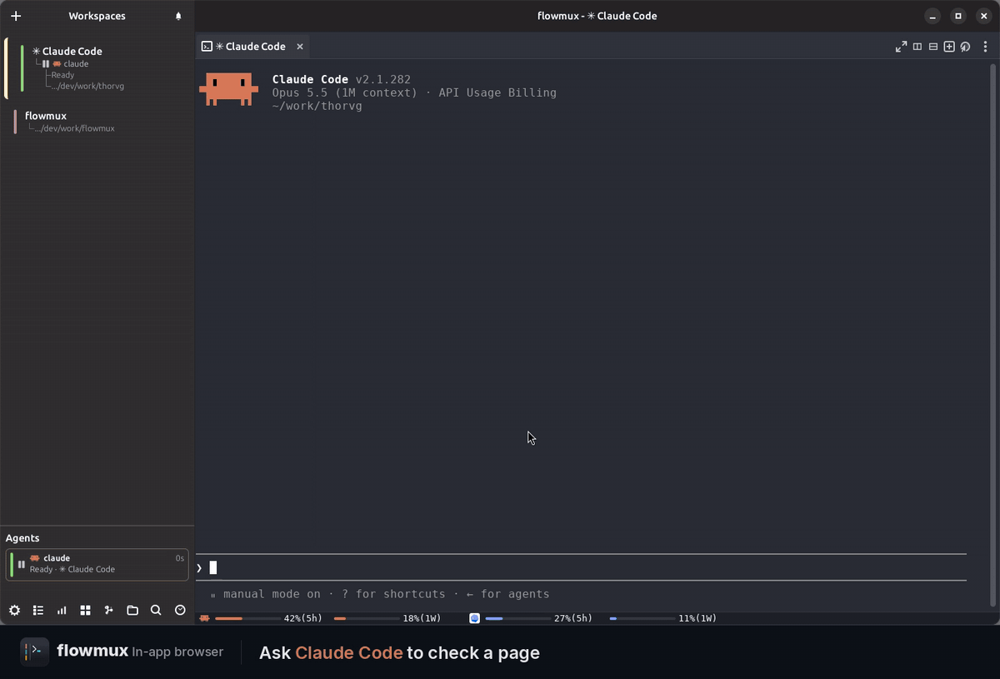
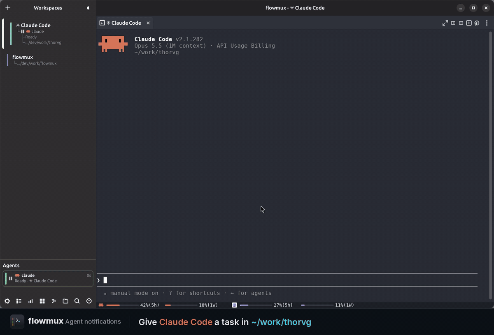
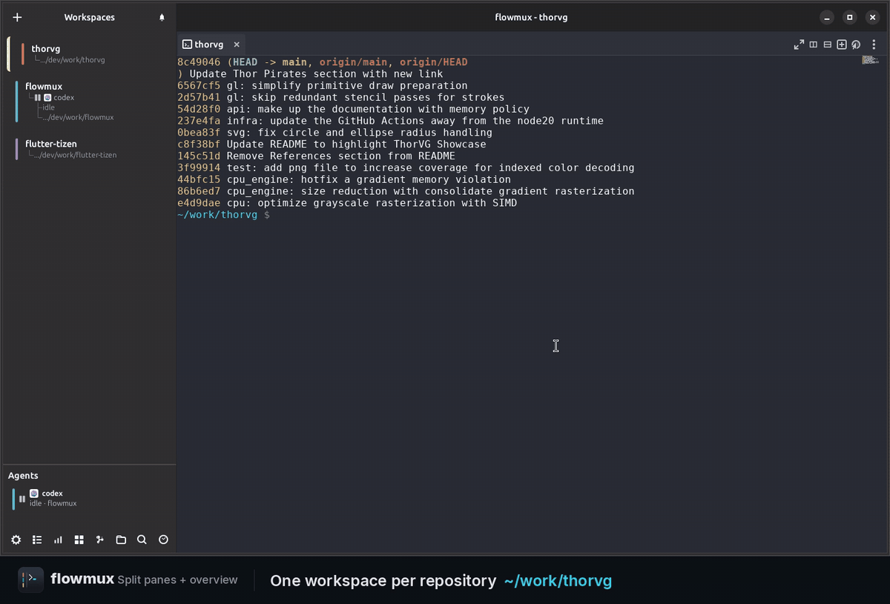
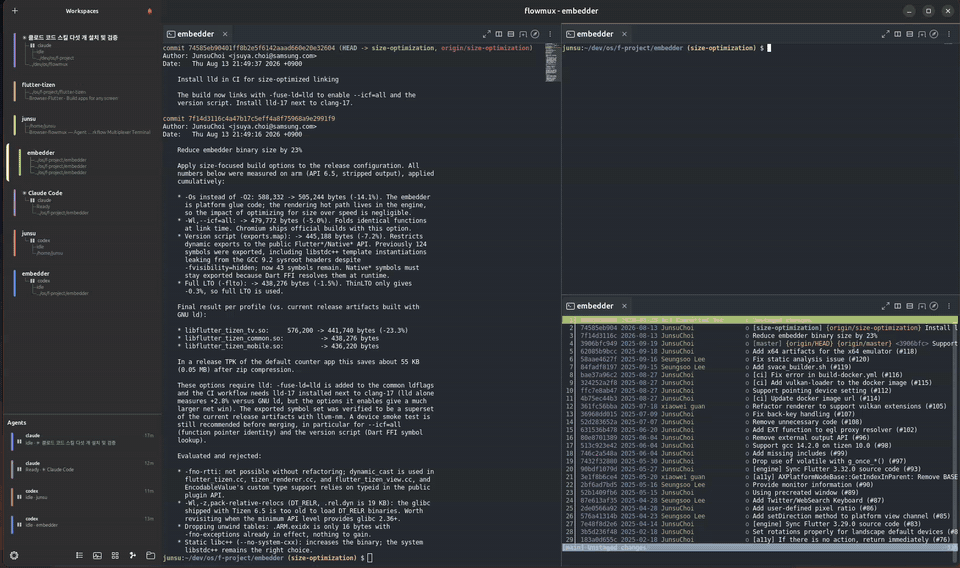
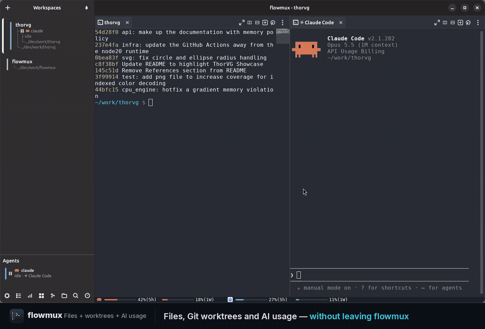
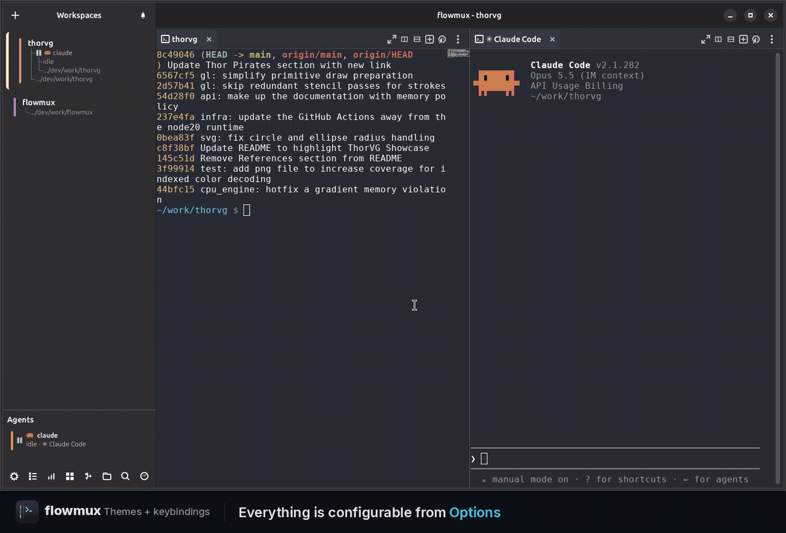
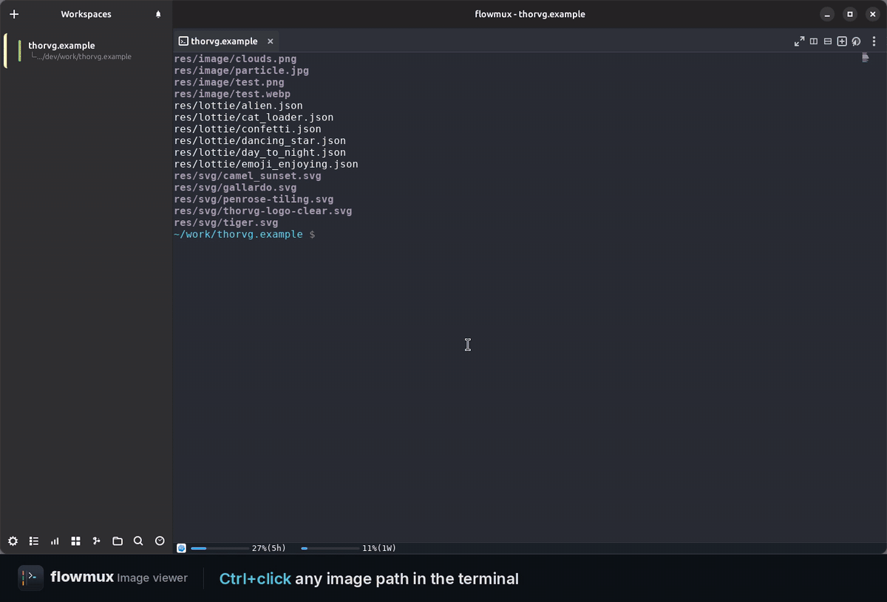
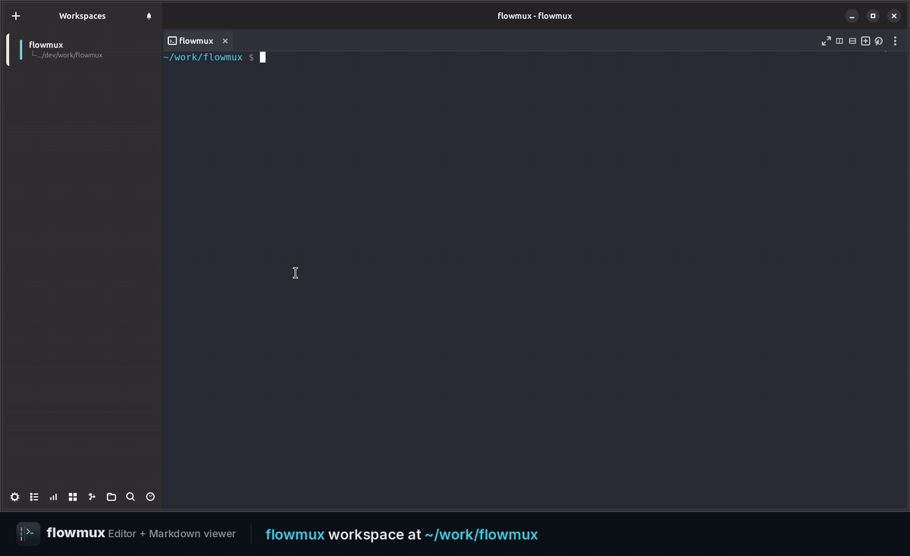

<div align="center">
  
# flowmux


**Agent Workflow Multiplexer Terminal** — *Go with the agents' flow.*

[Website](https://flowmux.org/) · [Latest release](https://github.com/flowmux-ai/flowmux/releases/latest)


</div>

### A terminal for AI agent workflows, browser control, and task signals.

flowmux is a Linux/GTK4 terminal for AI coding agents. The terminal pane uses
the system VTE widget for terminal emulation, flowmux-owned PTYs, and GTK integration.
Supported on Ubuntu 24.04 and later.

> Unofficial GPL-3.0-or-later reimplementation inspired by [cmux](https://cmux.com/ko), a macOS/AppKit app. Not affiliated with cmux.

## Install (Ubuntu 24.04+, amd64)

```sh
curl -fsSL https://flowmux.org/install.sh | sh
```

Uninstall the release package with `sudo apt remove flowmux`.
  
## Control internal browser

A WebKitGTK 6.0 browser tab lives next to terminal tabs in the same pane tree.
The clip shows an AI agent driving the page over flowmux's IPC socket —
snapshot the DOM, click, type, read state back — with no system Chromium and
no separate driver.



## AI Agent notification (Claude, Codex, OpenCode)

`flowmux fix` adds lifecycle hooks to Claude Code, Codex, and OpenCode so
*task complete*, *needs approval*, and *error* events surface as native
desktop notifications — routed to the workspace that fired them, suppressed
while that surface is focused, and isolated per window.



## Split panes

Split a pane horizontally or vertically and drag the divider to resize. Mix
terminal and browser tabs across panes, and navigate between them from the
keyboard.



## Overview mode

See every active workspace at a glance and jump directly to the one you need.



## File and worktree views

Open the **Files** and **Worktrees** sidebars to browse the current repository,
inspect Git worktree status, and remove worktrees without leaving the terminal.



## Themes

Choose a built-in light or dark theme in **Options → Theme**, or customize the
terminal and editor background, text, cursor, selection, and font.



## Image viewer

Ctrl+click an image path in a terminal pane to preview it inline without
leaving flowmux. Supports **PNG, JPEG, WebP, GIF, SVG, and Lottie**
(`.lottie` / `.json`). Everything is drawn by
[ThorVG](https://www.thorvg.org/): PNG / JPEG / WebP / SVG are decoded and
rendered by ThorVG's own loaders, Lottie plays back frame by frame, and GIF
(which ThorVG has no loader for) is decoded with the Rust `image` crate and
then handed to ThorVG to render. ThorVG is an optional runtime dependency — see
[ThorVG (image viewer — optional)](#thorvg-image-viewer--optional).



## Markdown viewer

`flowmux-md-viewer` renders Markdown files in a WebKit view for a formatted,
scrollable preview.



## File and worktree views

Open the Files and Worktrees sidebars to browse the current repository,
inspect Git worktree status, and remove worktrees without leaving the terminal.
Open the AI Usage popover from the workspace controls to review current agent
token and activity totals without interrupting running sessions.

## Features

- **Workspaces & panes** — side-panel workspaces hold tasks side by side, each
  split into multiple keyboard-navigable panes mixing terminal and browser
  tabs. `Ctrl+Shift+K` copies the focused cwd; right-click for Copy path / URL.
- **In-app browser** — a WebKitGTK tab next to your terminals, drivable by
  agents in a neighbouring pane (snapshot, click, type, read state). Import a
  session from Firefox / Chrome / Chromium / Brave / Edge / Arc; **Web
  Inspector** opens WebKit dev tools.
- **Embedded editor** — double-click a text file in Files to edit it in the
  selected pane. Supports multilingual text and paths, atomic save, find and
  replace, Quick Open, workspace search, conflict comparison, close guards,
  and crash recovery without a separate editor runtime.
- **Notifications** — terminal "task complete" / "needs attention" signals
  become desktop notifications, routed to the firing workspace and quiet while
  focused. Bell popover **All Clear** clears all entries and toasts at once.
- **AI agent integration** — Claude Code, Codex, OpenCode are wired by `flowmux fix`;
  sessions persist across restarts. `claude-teams` opens a workspace pre-split
  into per-Claude panes. `flowmux doctor` / `fix` audit and repair wiring.
- **Agent CLI** — scripts and agents drive flowmux over its socket:
  `flowmux browser <op>` (snapshot / click / fill / type / press /
  is-visible / count / …), `flowmux identify` and `capabilities` for context
  discovery, `flowmux tree` to inspect the workspace → pane → tab structure,
  `workspace current|focus`, `focus-pane|close-pane`, `focus-tab|close-tab`,
  `send-keys`, and `read-screen` (terminal buffer dump). Pane args accept
  `pane:<uuid>` or fall back to
  `$FLOWMUX_PANE_ID`; supported commands accept `--json` for machine-readable
  output. Full contract in
  [`AGENTS.md`](AGENTS.md).
- **Customizable keybindings** — Options → **Keybindings** rebinds any shortcut
  (applies on OK, no restart), saved to
  `$XDG_CONFIG_HOME/flowmux/options.json`. IME/scroll terminal shortcuts
  (Shift+Enter Hangul flush, smart PgUp/PgDn) are fixed and not editable. The
  AI Usage popover opens and closes with **Ctrl+Alt+U** by default
  (**Cmd+Alt+U** on macOS; `toggle-usage-popover` in the Keybindings options).
  **Ctrl+Alt+G** opens `tig` in a new tab in the focused pane
  (**Cmd+Alt+G** on macOS; `open-tig` in the Keybindings options).

See the [keyboard shortcut reference](docs/keybindings.md) and
[configuration reference](docs/configuration.md).


### ThorVG (image viewer — optional)

The image viewer loads **ThorVG** at runtime (`dlopen`). It is **optional** —
flowmux builds and runs without it; only the image viewer needs it, and shows a
"ThorVG is unavailable or incompatible" message until a build with its C API
and image loaders is present (no flowmux rebuild needed).

On macOS, install the Homebrew package and restart flowmux:

```bash
brew install thorvg
```

Ubuntu does not package ThorVG, so install it with the helper script (needs
`meson` + `ninja-build`):

```bash
sudo scripts/install-thorvg.sh     # ThorVG v1.0.6 → /usr/local, then restart flowmux
PREFIX=$HOME/.local scripts/install-thorvg.sh  # no sudo
```

ThorVG must be built with the C API and all loaders; the script does that
(`meson -Dbindings=capi -Dloaders=all`). Where a distro packages such a build
you can use it instead — e.g. Debian `libthorvg-dev`, Fedora `thorvg`.

### Optional — full media playback in tab browser

WebKitGTK decodes media via GStreamer. Without these plugins pages still load,
but YouTube / Twitch / `<video>` may stall, miss subtitles, or fail on DRM:

```bash
sudo apt install \
    gstreamer1.0-plugins-good \
    gstreamer1.0-plugins-bad \
    gstreamer1.0-plugins-ugly \
    gstreamer1.0-libav
```

## Build

```bash
cargo build --release --workspace
```

Produces two binaries under `target/release/`:

- `flowmux` — GTK4 GUI; also forwards CLI subcommands to `flowmuxctl`.
- `flowmuxctl` — CLI helper invoked by the GUI and by agent hooks.

`flowmux read-screen` (terminal buffer dump) reads the viewport straight from
the VTE terminal buffer, so it works in every build.

For development:

```bash
cargo run -p flowmux           # debug GUI
cargo check --workspace        # type-check everything
scripts/check-ubuntu-compat.sh # Docker smoke check for 24.04/26.04
```

The Monaco editor bundle under `editor/flowmux-editor-web/dist` is committed,
so regular flowmux builds and installs do not require Node.js. Only developers
who change the editor frontend need Node.js 20 or newer and npm. Rebuild and
verify the locked assets with:

```bash
scripts/build-editor-assets.sh
```

The script uses `npm ci`, runs the TypeScript and multilingual path tests,
builds the worker bundles, and checks the distributable asset set. Commit the
updated `dist` directory and `package-lock.json` together.

## macOS local install

The macOS build uses Homebrew GTK / libadwaita and the system
WebKit.framework for the browser pane. It installs a
regular app bundle plus CLI binaries:

```bash
brew install pkg-config gtk4 libadwaita
scripts/install-macos.sh --check
scripts/install-macos.sh
open "$HOME/Applications/FlowMux.app"
```

The script installs `FlowMux.app` under `~/Applications` and copies `flowmux`,
`flowmuxctl`, and `flowmux-md-viewer` to `~/.local/bin`.

### Install a source build to the host

```bash
./install.sh                   # installs missing prerequisites, flowmux, and app icon
```

This installs `flowmux`, `flowmuxctl`, and `flowmux-md-viewer` binaries to
`~/.local/bin` and `~/.cargo/bin`, plus the desktop entry
(`~/.local/share/applications/com.flowmux.App.desktop`) and the app icons
(`~/.local/share/icons/hicolor/…`) so flowmux appears in the app launcher.
It uses the `fast` profile (release optimization without LTO) and the system
VTE library; no Zig toolchain or vendored terminal backend is required.
ThorVG (image viewer) is optional and loaded at runtime, so the build does not
depend on it; `install.sh` only prints a note if it is missing.
The installer leaves agent settings unchanged, including integrations removed
by the user. Run `flowmux fix` explicitly to enable or refresh them.

After installing, fully restart any running flowmux GUI to pick up the new
binary.

## Verify & repair

flowmux wires into host pieces: agent SKILL files, agent hooks, the browser
data dir, host browsers for the cookie importer, and the daemon socket.

```bash
flowmux doctor   # read-only audit; non-zero exit if anything needs fixing
flowmux fix      # re-install / refresh what doctor flagged
```

`doctor` prints one row per check with a status badge (`ok` / `fix` / `warn` /
`info`); `NO_COLOR=1` or piping disables colour. Run it after a flowmux
install/upgrade and after installing a new agent. `fix` is idempotent: hook
config entries without a flowmux marker are preserved, while flowmux-managed
SKILL copies are re-synced to the version embedded in the binary. Add `--json`
to either command for machine-readable output.

### Troubleshooting

Set `FLOWMUX_LOG=/path/to/flowmux.log` for a persistent diagnostic log.
Crash diagnostics are stored under `$XDG_STATE_HOME/flowmux/crashes` (usually
`~/.local/state/flowmux/crashes`). Start with `flowmux doctor`; it is read-only,
while `flowmux fix` repairs marked integration entries.

## License

GPL-3.0-or-later. See [`LICENSE`](LICENSE) and [`NOTICE`](NOTICE).
Contributions accepted under the same license; see
[`CONTRIBUTING.md`](CONTRIBUTING.md).
