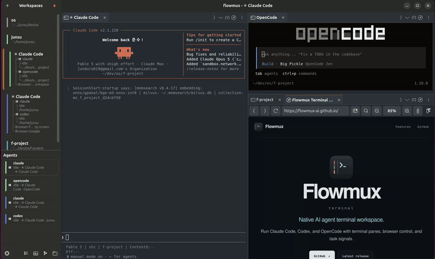

<div align="center">

# flowmux


**Agent Workflow Multiplexer Terminal** — *Go with the agents' flow.*

[](https://github.com/flowmux-ai/flowmux/actions/workflows/release.yml)
[](https://github.com/flowmux-ai/flowmux/actions/workflows/test.yml)
[](https://github.com/flowmux-ai/flowmux/releases/latest)

[Website](https://flowmux.org/) · [Latest release](https://github.com/flowmux-ai/flowmux/releases/latest)



</div>

flowmux is a Linux/GTK4 terminal built for AI coding agents. Workspaces in the
side panel hold tasks side by side; each one splits into panes that mix
terminal tabs and browser tabs. Agent hooks report turn state as desktop
notifications, and a CLI lets agents drive the browser, panes, and terminal
over a Unix socket. Supported on Ubuntu 24.04 and later.

> Unofficial GPL-3.0-or-later reimplementation inspired by [cmux](https://cmux.com/), a macOS/AppKit app. Not affiliated with cmux.

## Install (Ubuntu 24.04+, amd64)

```sh
curl -fsSL https://flowmux.org/install.sh | sh
```

The script installs the release `.deb`. Uninstall with `sudo apt remove flowmux`.
To build from source instead, see [Build from source](#build-from-source).

After installing or upgrading, run `flowmux fix` to wire agent hooks, then
restart any running agent sessions. See [Verify & repair](#verify--repair).

## Features

### Agent notifications

`flowmux fix` installs lifecycle hooks for Claude Code, Codex, OpenCode,
Gemini CLI, and Antigravity CLI. Each agent's session start/end is tracked
separately from its turn state (working, waiting for input, completed), and
"task complete" / "needs attention" signals become desktop notifications
routed to the firing workspace. Sessions persist across restarts. The bell
popover's **All Clear** dismisses every entry at once. Details of the hook
model are in [`docs/agent-status-verification.md`](docs/agent-status-verification.md).


### Browser tab

A WebKitGTK 6.0 browser tab sits next to terminal tabs in the same pane. An
agent in a neighbouring pane can drive it over the IPC socket — snapshot the
DOM, click, type, read state back — without a system Chromium or a separate
driver. Import a session from Firefox, Chrome, Chromium, Brave, Edge, or Arc;
**Web Inspector** opens WebKit's dev tools.


### Split panes and overview mode

Split a pane horizontally or vertically, drag dividers to resize, and move
between panes from the keyboard. Overview mode shows every active workspace
at a glance so you can jump straight to the one you need.


### Files, worktrees, and AI usage

The **Files** and **Worktrees** sidebars browse the current repository,
show Git worktree status, and remove worktrees without leaving the terminal.
Double-click a text file to open it in the embedded editor (find and replace,
Quick Open, workspace search, conflict comparison, crash recovery). The AI
Usage popover (**Ctrl+Alt+U**) shows current agent token and activity totals.


### Themes and keybindings

Pick a built-in light or dark theme in **Options → Theme**, or customize the
terminal and editor colors and font. **Options → Keybindings** rebinds any
shortcut without a restart; settings live in
`$XDG_CONFIG_HOME/flowmux/options.json`. See the
[keyboard shortcut reference](docs/keybindings.md) and
[configuration reference](docs/configuration.md).


### Image and Markdown viewers

Ctrl+click an image path in a terminal to preview it inline. PNG, JPEG,
WebP, GIF, SVG, and Lottie (`.lottie` / `.json`) are supported; rendering
needs the optional [ThorVG](#thorvg-image-viewer) runtime library. Markdown
files open in a formatted, scrollable WebKit preview.


### Agent CLI

Scripts and agents drive flowmux through `flowmux <verb>` (forwarded to
`flowmuxctl`): `browser <op>` for snapshot / click / fill / type / press,
`identify` and `capabilities` for context discovery, `tree` for the
workspace → pane → tab structure, `focus-pane` / `close-pane`,
`focus-tab` / `close-tab`, `send-keys`, and `read-screen`. Pane arguments
fall back to `$FLOWMUX_PANE_ID` inside a pane, and `--json` gives
machine-readable output. `claude-teams` opens a workspace pre-split into
per-Claude panes. The full contract is in [`AGENTS.md`](AGENTS.md).

## Optional runtime dependencies

### ThorVG (image viewer)

The image viewer loads ThorVG with `dlopen` at runtime. flowmux builds and
runs without it; the viewer shows a "ThorVG is unavailable" message until a
build with the C API and image loaders is present. Ubuntu does not package
ThorVG, so build it with the helper script (needs `meson` and `ninja-build`):

```bash
sudo scripts/install-thorvg.sh                 # ThorVG v1.0.6 → /usr/local
PREFIX=$HOME/.local scripts/install-thorvg.sh  # no sudo
```

Restart flowmux afterwards. Distro packages built with `-Dbindings=capi
-Dloaders=all` also work (Debian `libthorvg-dev`, Fedora `thorvg`, Homebrew
`thorvg`).

### GStreamer (browser media)

WebKitGTK plays media through GStreamer. Without these plugins pages still
load, but video sites may stall or miss subtitles:

```bash
sudo apt install gstreamer1.0-plugins-good gstreamer1.0-plugins-bad \
  gstreamer1.0-plugins-ugly gstreamer1.0-libav
```

## Build from source

Prerequisites on Ubuntu 24.04+ (Rust stable, MSRV 1.93):

```bash
sudo apt install build-essential pkg-config git curl ca-certificates \
  libgtk-4-dev libadwaita-1-dev libvte-2.91-gtk4-dev libwebkitgtk-6.0-dev \
  libssl-dev libdbus-1-dev libsecret-1-dev
```

Install to the host (builds with the `fast` profile, then installs
`flowmux`, `flowmuxctl`, and `flowmux-md-viewer` to `~/.local/bin` plus the
desktop entry and icons):

```bash
./install.sh
```

`install.sh` offers to install missing apt packages and the Rust toolchain.
It leaves agent settings unchanged; run `flowmux fix` to enable hooks.
Restart any running flowmux GUI to pick up the new binary.

For development:

```bash
cargo build --release --workspace   # binaries under target/release/
cargo run -p flowmux                # debug GUI
cargo check --workspace             # type-check everything
xvfb-run -a dbus-run-session -- cargo test --workspace --locked
scripts/check-ubuntu-compat.sh      # Docker smoke check for 24.04 / 26.04
```

The Monaco editor bundle under `editor/flowmux-editor-web/dist` is committed,
so builds do not need Node.js. Only changes to the editor frontend need
Node.js 20+; rebuild with `scripts/build-editor-assets.sh` and commit the
updated `dist` directory and `package-lock.json` together.

### macOS (development only)

macOS builds use Homebrew GTK / libadwaita and the system WebKit for the
browser tab. `scripts/install-macos.sh` installs `FlowMux.app` under
`~/Applications` and the CLI binaries to `~/.local/bin`:

```bash
brew install pkg-config gtk4 libadwaita
scripts/install-macos.sh --check
scripts/install-macos.sh
```

## Verify & repair

flowmux wires into host pieces: agent hooks, agent SKILL files, the browser
data dir, host browsers for cookie import, and the daemon socket.

```bash
flowmux doctor   # read-only audit; non-zero exit if anything needs fixing
flowmux fix      # install / refresh what doctor flagged
```

Both accept `--json`. `fix` is idempotent: hook entries without a flowmux
marker are preserved, and flowmux-managed SKILL copies are re-synced to the
version embedded in the binary. Restart running agent sessions afterwards so
they reload hook configuration.

Codex asks you to approve changed user hooks in `/hooks`; flowmux does not
bypass that. Codex configurations with `allow_managed_hooks_only = true`
cannot load these hooks, and `doctor` reports that policy.

### Troubleshooting

- `FLOWMUX_LOG=debug` (or any `tracing` filter) raises console log verbosity.
- Daily log files are written under `$XDG_STATE_HOME/flowmux/logs`
  (usually `~/.local/state/flowmux/logs`); crash reports go to
  `$XDG_STATE_HOME/flowmux/crash`.

## License

GPL-3.0-or-later. See [`LICENSE`](LICENSE) and [`NOTICE`](NOTICE).
Contributions are accepted under the same license; see
[`CONTRIBUTING.md`](CONTRIBUTING.md).
