<div align="center">

# flowmux


**Agent Workflow Multiplexer Terminal** — *Go with the agents' flow.*

[](https://github.com/flowmux-ai/flowmux/actions/workflows/release.yml)
[](https://github.com/flowmux-ai/flowmux/actions/workflows/test.yml)
[](https://github.com/flowmux-ai/flowmux/releases/latest)

[Website](https://flowmux.org/) · [Releases](https://github.com/flowmux-ai/flowmux/releases/latest) · [Documentation](#documentation)

<a href="https://flowmux.org/assets/flowmux-intro.mp4">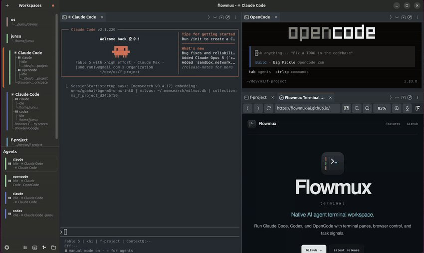</a>

[▶ Watch the introduction video](https://www.youtube.com/watch?v=9o_WNinRjGY)

</div>

Run AI coding agents side by side, with terminals, browser tabs, and task
notifications in one window.

## Install

**Ubuntu 24.04+ · amd64**

```sh
curl -fsSL https://flowmux.org/install.sh | sh
flowmux fix
```

Open flowmux and launch your agents in terminal tabs. `flowmux fix` sets up
agent hooks; run it again after upgrades and restart running agent sessions.
Codex users must approve changed hooks in `/hooks`.

Uninstall: `sudo apt remove flowmux`.

On first launch, Flowmux shows a six-page welcome tour with screenshots of
notifications, pane splitting, session history, search, Files and the editor,
and workspace overview. Use `flowmux --first-screen` to show it again.

For read-only integration diagnostics, open **Options → Update → Integration
status → Run diagnostics**, or run `flowmux doctor` (`flowmux --json doctor`
for scripts). Both check agent skills and hooks, IPC connectivity, browser data,
and desktop installation. Rows tagged `fix` can be repaired with `flowmux fix`;
errors include details for manual investigation. The CLI exits with status 1
for `fix` or `error` rows; warnings alone do not change its exit status.

## Features

### Agent notifications

Know which agent needs you. When Claude Code, Codex, OpenCode, Gemini CLI,
or Antigravity CLI finishes a task or stops for approval, its workspace
lights up, the bell keeps the list, and a desktop notification pops up.
Click a notification to jump straight back to that agent.

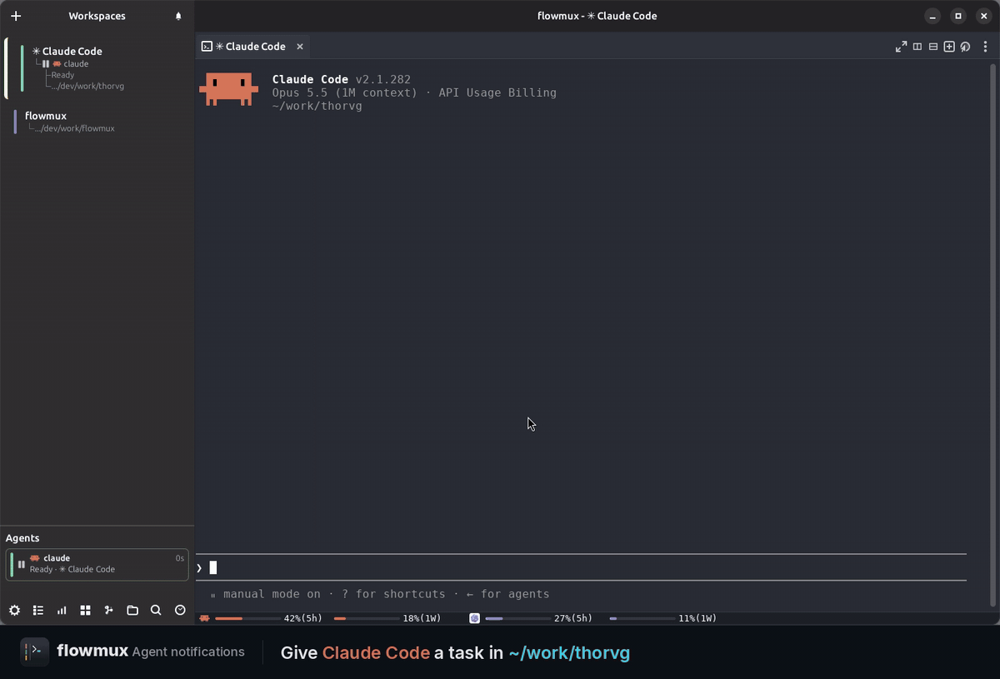

### Browser tab

Browse next to your terminals, or let your agents do it. With the
`flowmux browser` CLI an agent can open a page, read it, fill in fields,
and click through it in a pane you can watch. Browser tabs share WebKit
session data within each flowmux profile, separately from your host browsers.

Linux also offers opt-in [WebKitWebDriver automation](docs/webkit-automation.md)
for Selenium clients and engine-level mouse/keyboard input in ephemeral browser
windows. It requires a WebKitGTK runtime built with WebDriver input enabled.

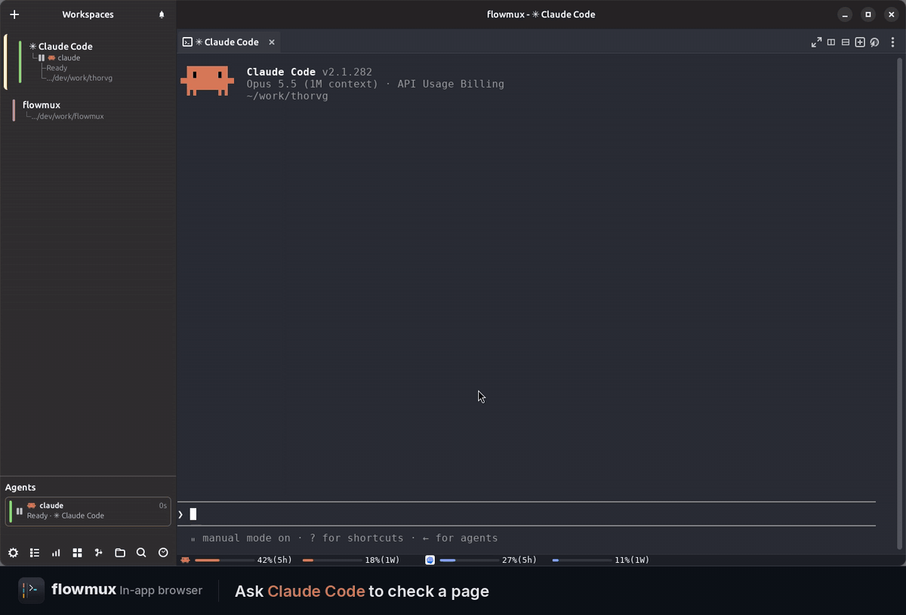

### Split panes and overview mode

Split right or down, zoom into one pane when you need focus, and start
another agent in a new tab. Overview mode (**Ctrl+Alt+K**) shows every
workspace at once so you can jump between tasks.

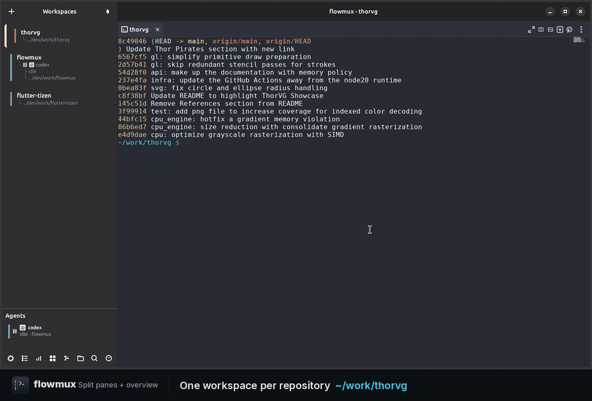

### Files, worktrees, and AI usage

Browse the repository and open files in the built-in editor. The worktree
panel lists every Git worktree with its branch and path. **Ctrl+Alt+U** shows
Claude and Codex usage, which also stays in the bar below the terminal.

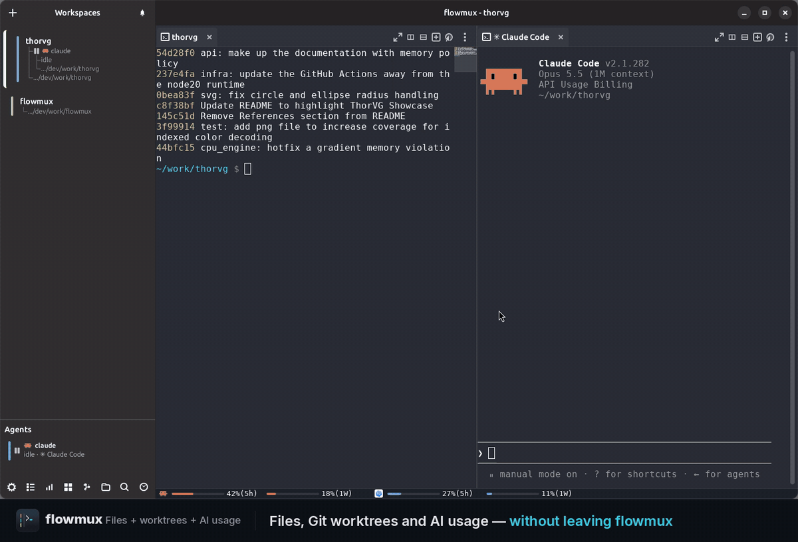

### Code Review

Review staged, unstaged, and new files in your terminal pane. Add comments
to code or whole files, then send the feedback with code context to a running
agent. Toggle Code Review with **Ctrl+Alt+E**.

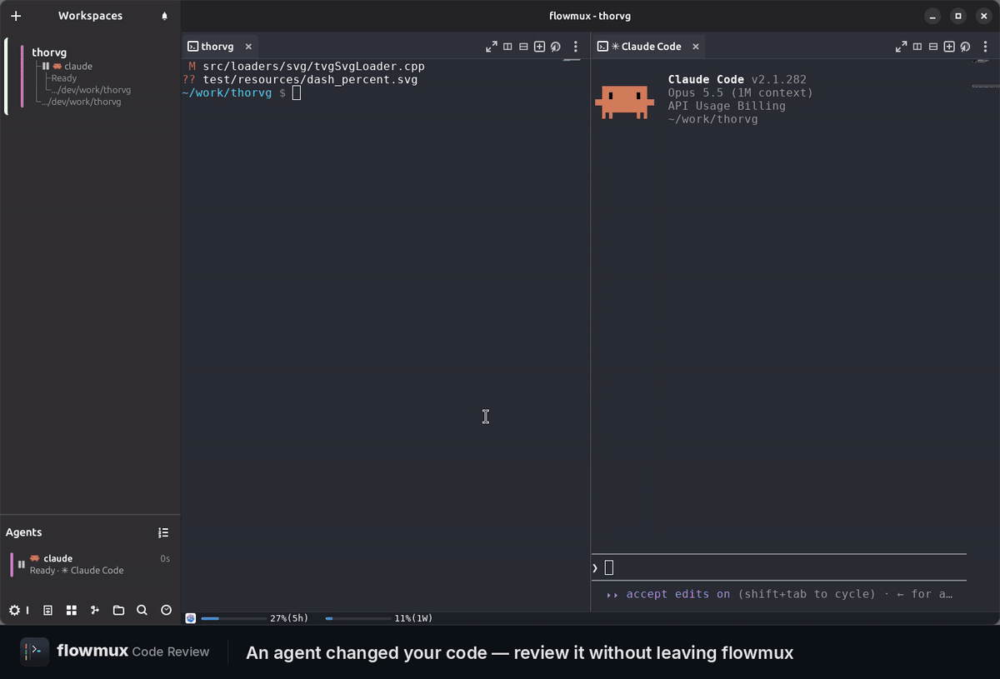

### Search terminal output

Search output across workspaces and terminal tabs with **Ctrl+Alt+Shift+F**.
Each result shows its workspace and tab. Click a result or use the arrow keys
and Enter to jump to the matching line, even in a hidden tab.

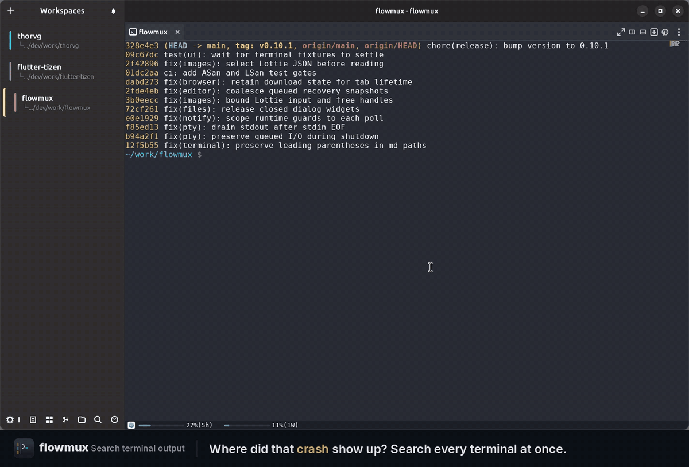

### Themes and keybindings

Pick a built-in theme, from Dracula to GitHub Light, or set your own colors
and fonts. Every shortcut can be rebound in **Options**, and the change works
right away without a restart.

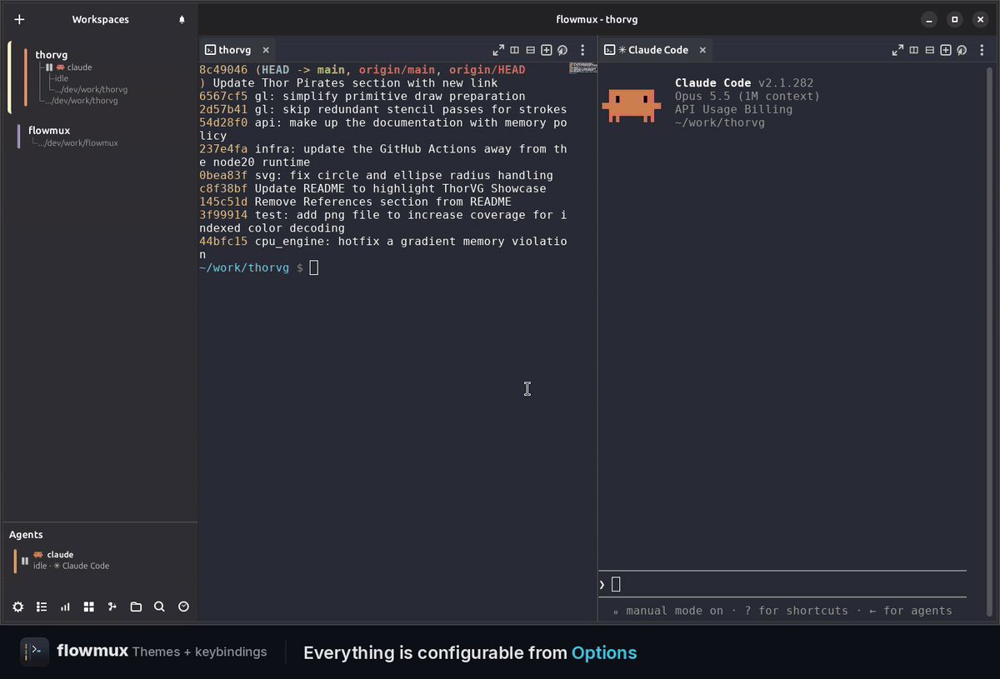

### Image and Markdown viewers

Ctrl+click an image path to open it, or double-click it in the file browser.
SVG stays sharp at any size and Lottie animations play right away. Markdown
opens as a formatted preview that refreshes every time you save, so you can
write in the built-in editor and watch the result side by side. Images require
[ThorVG](docs/setup.md#thorvg-image-viewer).

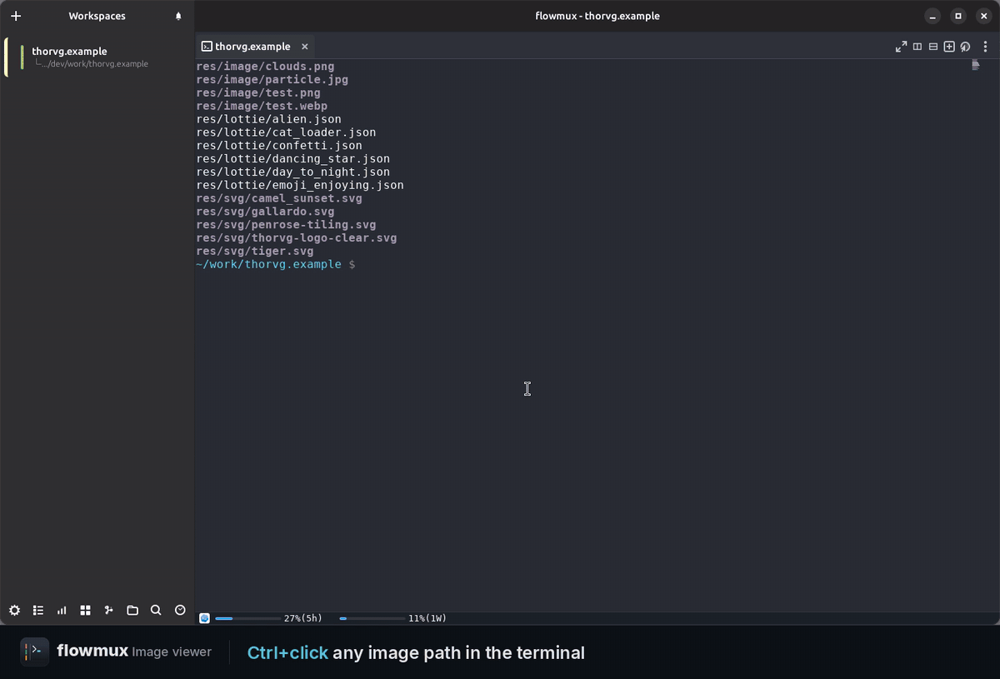
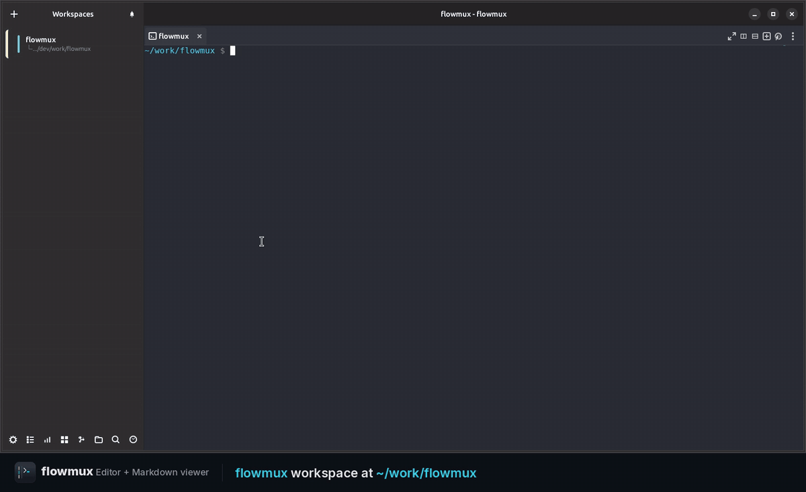

### Agent CLI

Control browser tabs, panes, and terminals through `flowmux` commands.
See the [CLI guide](AGENTS.md) for automation and JSON output.

### Team workspace

Give one lead agent a task and let it coordinate the team. In a **Team workspace**,
Claude Code and Codex workers run in visible split panes, each with its own
assignment. The lead collects their results, asks for corrections, and checks the
finished work. You can follow every conversation and continue with the same
workers for the next round.

Install **Flowmux Team** for your agent from **Options → Skills**, then choose
**New Team Workspace** from the sidebar menu or command palette. Start your lead
agent there and ask it to delegate research, implementation, or review.
See the [team guide](docs/agent-teams.md) for setup and example workflows.

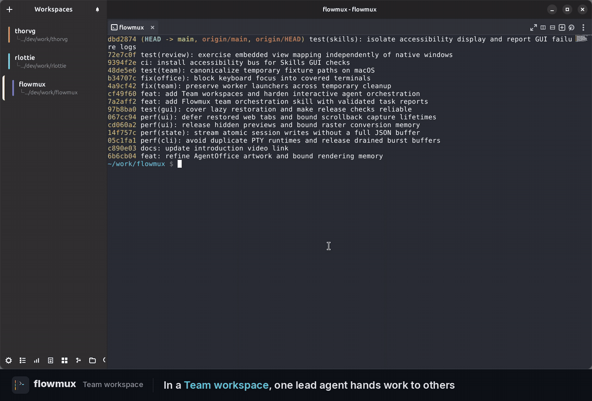

### AgentOffice

See your agents at work in a living pixel-art office. Each workspace with active
agents becomes a room, where characters work at desks, wait for your input, or
relax when their task is done. Status icons and speech bubbles help you spot who
needs attention across Claude Code, Codex, and other agents.

Open **AgentOffice** with the home icon in the side panel's **Agents** header.
Select an office sign to enlarge that room, or **All offices** to return to the
map. Click an agent to jump to its terminal, and press **Esc** to return to your
workspace. Team workers can create new split panes in the background while you
keep watching the office.

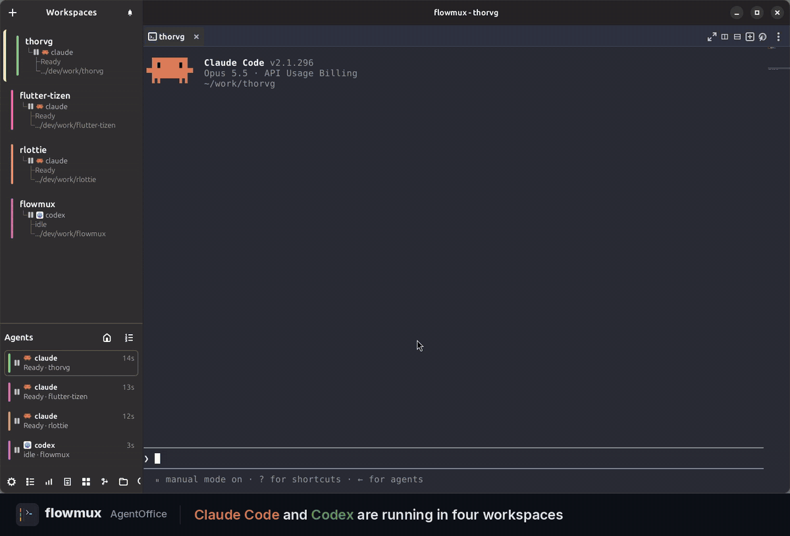

### SSH workspaces

Work on remote hosts with the same tabs and splits. Right-click the side
panel → **New SSH Workspace**, or run `flowmux ssh connect user@host`.

## Build from source

From a repository checkout:

```sh
./install.sh
```

See the [setup guide](docs/setup.md#build-from-source) for prerequisites,
development commands, and macOS development builds.

## Verify & repair

```sh
flowmux doctor   # check setup
flowmux fix      # repair integrations
```

See [setup and troubleshooting](docs/setup.md) for optional image/media
support, hook configuration, and logs.

## Documentation

- [Documentation index](docs/README.md) · [Release history](https://github.com/flowmux-ai/flowmux/releases)
- [Keyboard shortcuts](docs/keybindings.md) · [Configuration](docs/configuration.md)
- [Agent CLI and browser automation](AGENTS.md) · [SSH workspaces](docs/ssh-workspaces.md)
- [Flowmux CLI skill: features and installation](docs/agent-skills.md) — install for your agent from **Options → Skills**.
- [Contributing](.github/CONTRIBUTING.md)

## License

[GPL-3.0-or-later](LICENSE) · [Notices](NOTICE).
[Third-party licenses and notices](docs/legal/THIRD_PARTY_LICENSES.md).
Inspired by [cmux](https://cmux.com/); an unofficial reimplementation,
not affiliated with cmux.
