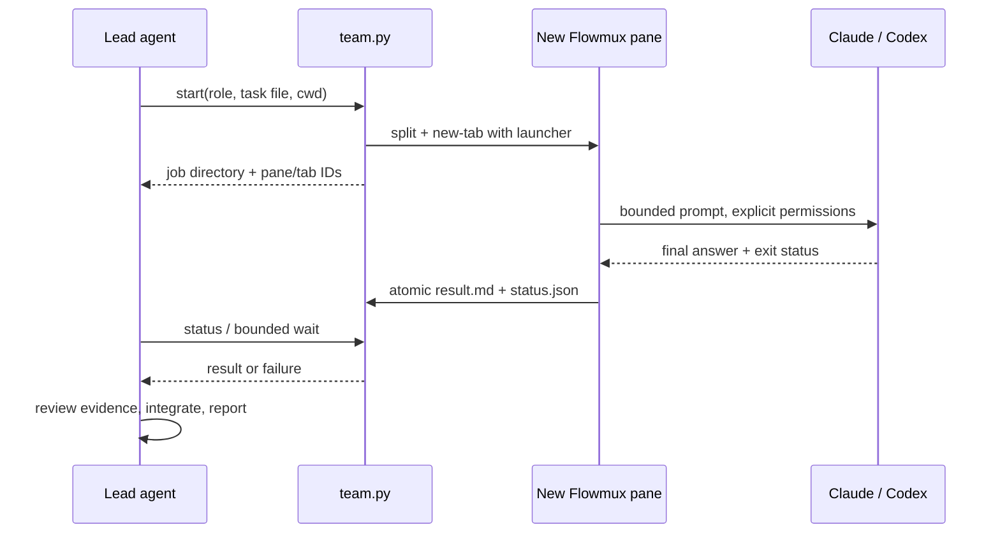

<!-- SPDX-License-Identifier: GPL-3.0-or-later -->

# Flowmux team skill

`flowmux-team` delegates a bounded task from a lead agent to a new Claude Code
or Codex process in another visible pane, then returns a file-backed result to
the lead. A role describes the worker's responsibility; a task file supplies
context, file ownership and acceptance checks.

## Design



The existing Flowmux CLI supplies pane creation and terminal launch. There is no
new Rust command, daemon, queue or dependency. Each private job directory stores
the assignment, IDs, prompt, logs, completion status and result. Workers verify
their assigned pane/socket and claim an exclusive marker before invoking an
agent. Reopening a restored launcher cannot silently repeat a task.
Socket aliases are resolved and pinned before launch, so a moving alias cannot
redirect later calls to another window.

Workers can run concurrently after sequential launches. For dependent work,
the lead includes the previous result in the next task file. Editing workers
need separate worktrees or explicit nonoverlapping ownership. The lead retains
responsibility for checks and integration; an agent's exit code does not prove
its conclusions or edits are correct.

Success requires a zero exit code and a JSON final answer declaring
`task_status: completed` with a nonempty string `report`. Workers may instead
report `blocked` or `failed`; these preserve their report in `result.md` but
return failure from status/wait and stop the sample's dependent reviewer.
Malformed reports fail closed. The process `exit_code` and reported task outcome
are separate, and the lead must still verify the evidence. Claude also must
report neither an API error nor denied tools. A failed launch is not automatically
retried, since IPC failure can follow successful dispatch. Execution deadlines
terminate only the worker's own process group. Waiting has a separate deadline
and does not cancel a task. GUI crashes or hard-killed workers may leave stale
state and require inspection. Temporary artifacts and panes remain for review.

## Use and installation

Read [the skill](../.agents/skills/flowmux-team/SKILL.md), then run
[the researcher → reviewer sample](../.agents/skills/flowmux-team/references/sample.md)
from a trusted local repository inside Flowmux. Python 3.9+ and an authenticated
agent CLI are required. The sample uses the configured model and account.

This optional skill is currently distributed as a repository directory. Copy
the **whole** `.agents/skills/flowmux-team` directory, including `scripts/` and
`references/`, to the desired agent's skills root:

| Agent | Destination directory |
|---|---|
| Claude Code | `~/.claude/skills/flowmux-team` (`CLAUDE_CONFIG_DIR` overrides the root) |
| Codex | `~/.agents/skills/flowmux-team` |

For example, from this repository, install a new Claude copy without replacing
an existing directory:

```bash
python3 - <<'PY'
import os
from pathlib import Path
import shutil
root = Path(os.environ.get('CLAUDE_CONFIG_DIR', Path.home() / '.claude'))
shutil.copytree('.agents/skills/flowmux-team', root / 'skills/flowmux-team')
PY
```

An existing destination raises an error; inspect and back up local changes
before updating it. Reload the agent at a convenient boundary to discover the
skill. The existing Options → Skills and `flowmux agent install/doctor/fix`
manage only `flowmux-browser`; they do not install, update or remove this copy.
The source is also discoverable by agents that load repository `.agents/skills`.

## Limits and validation

The helper supports local Flowmux panes with Claude Code and Codex. It does not
attach to an existing agent conversation. For existing Claude sessions, use
Claude's `ListAgents`/`SendMessage` contract described in [AGENTS.md](../AGENTS.md).
It does not implement the native Claude Agent Teams shared task list, automatic
merges, permissions bypasses, persistent scheduling or remote SSH workers.

Claude workers have file-reading tools, plus Edit/Write when explicitly enabled;
they do not execute shell tests. Codex editing workers use `workspace-write`.
Provider configuration, hook trust and authentication are retained. Quota or
permission failures remain failures; do not weaken permissions to pass a demo.

Run the account-free regression checks with `python3 scripts/test-agent-team.py`.
Run the sample to verify actual pane creation, provider execution and handoff;
mocked agent checks alone do not establish that authentication or a model works.
