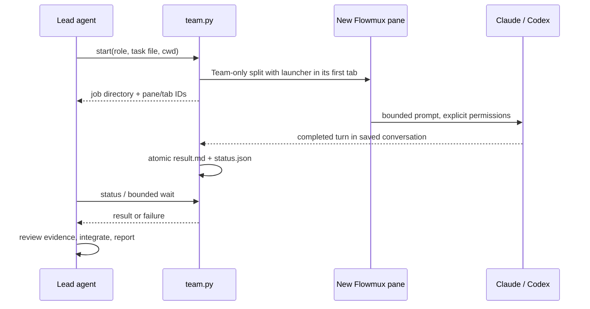

<!-- SPDX-License-Identifier: GPL-3.0-or-later -->

# Flowmux team skill

`flowmux-team` delegates a bounded task from a lead agent to a new Claude Code
or Codex process in another visible pane, then returns a file-backed result to
the lead. A role describes the worker's responsibility; a task file supplies
context, file ownership and acceptance checks.

## Design



The helper first resolves the lead's workspace with `team.py context`. Normal
and SSH workspaces return `inline`: the current agent completes the work itself.
Team workspaces allow `team-spawn`, which creates a split with a single tab
running the normal interactive Claude Code or Codex interface. The provider's
initial prompt carries a task-file reference and a unique job marker. Each worker may use a
different provider; pass the first report into the next worker's task file for
cross-provider review.

Codex source resolution validates direct agent/window process ancestry on the
first turn. Shared daemons still require a unique reported session binding;
working directory, window focus and tab titles cannot select a launch target.
A worker remains in the lead's workspace even when its working directory differs.

Results come from a completed turn in the saved conversation containing the
exact job marker in its user prompt. The final JSON report must declare
`task_status: completed|blocked|failed` and a nonempty `report`. Tool output and
intermediate commentary cannot complete a task. Missing, malformed and ambiguous
reports fail closed. Reports, session/transcript IDs and pane receipts stay in
the private job directory. Read-only sandbox/tool restrictions remain in place.

The interactive agent stays open after completing its turn. Flowmux CLI
`read-screen`, `send-keys` and `send-key` support inspecting and continuing an
idle worker's conversation. The original job records only its initial turn.
A report-collection timeout preserves the session for diagnosis; it does not
kill the agent or approve dialogs. A restored launcher never reruns its task.
With automatic agent restoration enabled, the launcher passes the saved resume
command to a real shell so the conversation reopens in its original pane.
New jobs pin the lead's provider configuration roots for execution, transcript
lookup and restoration; quota fallback also uses the CLI resolved on the lead's
PATH. Only paths are stored, not authentication tokens.

The supervisor owns an OS file lock. Status/wait and launcher reentry reconcile
an unfinished job whose owner exited to `failed` / `interrupted`, including
after a forced termination. Completed, blocked, failed and timed-out outcomes
are never rewritten. This does not kill a surviving child or replay partial work.
Older jobs without the lock marker cannot be reconciled this way.

## Use and installation

Read [the skill](../.agents/skills/flowmux-team/SKILL.md), then run
[the researcher → reviewer sample](../.agents/skills/flowmux-team/references/sample.md)
from a trusted local repository in a **Team workspace**. Create one with the
sidebar menu or command palette → **New Team Workspace**, or
`flowmux workspace new --team --root /absolute/project`, then start the lead
agent there. Normal and SSH workspaces reject team worker creation. Each worker
uses the split’s sole tab and displays its native interactive interface. Python 3.9+ and an authenticated
agent CLI are required. The sample selects a simple-tier model on the configured account.

The lead also needs access to that window's Unix socket and `.ctl` companion.
Codex can deny these connections even when it can read the repository. The CLI
reports socket permission errors separately from an unresolved session. Use
Codex's normal permission approval flow for authorized Flowmux commands; stop
if approval is denied. In Linux verification with Codex 0.162.0, the network
proxy returned `unix sockets unsupported` even with a Unix socket allowlist,
so that setting alone is not a working solution on that build. Installing the
skill does not grant socket access, disable the sandbox, or change hook trust.

Open **Options → Skills → Flowmux Team** to install for Claude Code or Codex.
Each row checks the complete bundle: `SKILL.md`, `scripts/team.py`, and
`references/sample.md`. Missing or changed resources offer **Update**, which
backs up changed files before replacement. **Remove** deletes those three
managed files, preserves modified content in backups, and leaves unrelated files
alone. Linked resource directories are user-managed and cannot be changed here.
The instructions preview is read-only; Python and agent CLIs must already be
installed. Start a new agent session if the skill is not discovered immediately.

`flowmux doctor` checks existing team installations and `flowmux fix` repairs
them. The team skill remains opt-in: repair does not create a new installation
or reinstall a fully removed bundle. `flowmux agent install/doctor/uninstall`
continue to target the Flowmux CLI skill.

For manual installation, copy the **whole** `.agents/skills/flowmux-team` directory, including `scripts/` and
`references/`, to the desired agent's skills root:

| Agent | Destination directory |
|---|---|
| Claude Code | `~/.claude/skills/flowmux-team` (`CLAUDE_CONFIG_DIR` overrides the root) |
| Codex | `~/.agents/skills/flowmux-team` |

For example, from this repository, install a new Claude copy without replacing
an existing directory:

```bash
python3 - <<'PY'
import os
from pathlib import Path
import shutil
root = Path(os.environ.get('CLAUDE_CONFIG_DIR', Path.home() / '.claude'))
shutil.copytree('.agents/skills/flowmux-team', root / 'skills/flowmux-team')
PY
```

An existing destination raises an error; inspect and back up local changes
before updating it. Reload the agent at a convenient boundary to discover the
skill. The GUI can manage this copy after installation.
The source is also discoverable by agents that load repository `.agents/skills`.

## Limits and validation

The helper supports local Flowmux panes with Claude Code and Codex. It does not
attach to an existing agent conversation. For existing Claude sessions, use
Claude's `ListAgents`/`SendMessage` contract described in [AGENTS.md](../AGENTS.md).
It does not implement the native Claude Agent Teams shared task list, automatic
merges, permissions bypasses, persistent scheduling or remote SSH workers.

Claude workers have file-reading tools, plus Edit/Write when explicitly enabled;
they do not execute shell tests. Codex editing workers use `workspace-write`.
Provider configuration, hook trust and authentication are retained. Permission
failures remain blockers; do not weaken permissions to pass a demo.

Run the account-free regression checks with `python3 scripts/test-agent-team.py`.
Run the sample to verify actual pane creation, provider execution and handoff;
mocked agent checks alone do not establish that authentication or a model works.
On Linux, `python3 scripts/test-skills-gui.py` checks the actual Settings controls,
bundle repair/removal, the installed sample's handoff, profile inheritance,
session restoration and interrupted workers with fixture agents in an isolated
GUI. It requires the accessibility and Xvfb dependencies listed in
the script and preserves screenshots and logs in its printed artifact directory.

## Task routing and prompt size

The lead chooses a provider per assignment: Codex for code investigation and
implementation, Claude for independent review or synthesis; review Claude's
implementation with Codex when useful. Explicit user choices take priority.
This is a workflow default, not a provider capability restriction. Simple work
needs no automatic second reviewer.

`team.py start --complexity simple|standard|complex` chooses a model and effort
for the new worker only. Defaults are Luna/high, GPT-6.1 Sol/medium, Astra/high
for Codex, and Haiku/low, Sonnet/medium, Fable/high for Claude. The default tier
is standard. `--model` and `--effort` override that selection; `team.py route`
previews it without creating panes. Model availability depends on the account
and CLI. Unavailable models remain blockers. Native session/credit exhaustion
switches once to the other provider at the same complexity tier, unless
`--no-fallback` is set. The helper stops its own original worker before launching
the replacement in the same pane/tab with the original task and prior evidence.
Both attempts are retained; final status identifies the effective provider/model
and `fallback_used`. If both providers are exhausted, stop. Authentication,
permissions, transient rate limits, timeout and uncertain launches never trigger
substitution. Existing lead sessions and provider settings are unchanged.
Automatic substitution covers helper-managed initial turns only. A review whose
provider changed to the researcher's provider is no longer cross-provider review.

Assignments are copied into private job `task.txt` files. The interactive TUI
receives a short file reference plus the result contract. Give workers relevant
file paths/lines and result paths rather than duplicating full source files.
Reading those files still consumes context; the lead should keep assignments
focused and ask for concise reports. Full assignments are preserved without truncation.

Codex model guidance: https://developers.openai.com/codex/models/ . Claude model
aliases and effort flags follow the installed `claude --help`; specific versions
and account access must be checked in that client.
