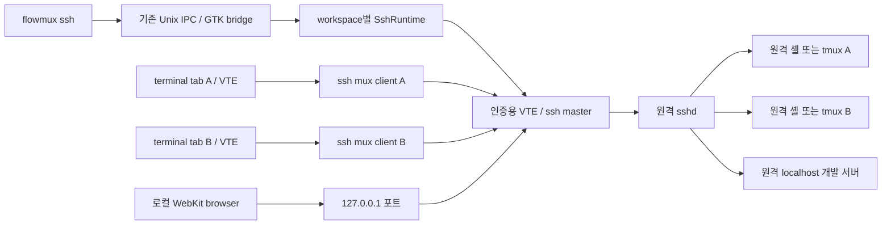

<!-- SPDX-License-Identifier: GPL-3.0-or-later -->

# SSH workspace 구현 설계

상태: 1차 기능 구현 및 Linux 실환경 검증 완료. [검증 기록](ssh-workspace-validation.md) 참조. 기준일: 2026-09-09. 설계 기준 코드: `16b6586e4831659e25b9e16b382afb05831217a1`.

이 문서는 최초 설계와 후속 요구사항도 포함한다. 현재 구현·검증 범위는 검증 기록이 기준이다. password/MFA, macOS, 강제 crash 복구 전체는 검증하지 않았다. SSH preview는 Linux에서만 활성화한다. host 설정 변경 UI, 원격 tmux 종료 UI, 원격 cwd 관측 시각 표시, 일회성 명령의 실행 여부 불명 전용 표시는 후속 항목이다.

**workspace마다 OpenSSH 제어 연결 하나를 소유하고, terminal tab마다 그 연결의 별도 SSH channel을 사용한다.** 원격 경로·세션을 로컬 데이터와 타입으로 구분한다. 원격에 flowmux를 설치하지 않아도 terminal, 분할, 수동 port forwarding, 재접속이 가능한 것을 첫 배포 기준으로 삼는다. 원격 agent hooks·Git·파일 편집은 다음 단계에서 제한된 helper를 통해 지원한다.

## 1. 사용자 경험과 범위

주 GUI 진입점은 side panel 우클릭 메뉴의 `New SSH Workspace`다. 기존 local 생성은 같은 메뉴의 `New workspace`로 제공한다. CLI의 `flowmux ssh devbox --cwd /srv/project` 또는 command palette에서도 SSH 생성에 접근할 수 있다. `devbox`는 사용자의 `~/.ssh/config` Host alias를 그대로 사용한다. 비밀번호·키 암호·MFA·새 host key 확인은 workspace 연결 화면의 VTE terminal에서 OpenSSH가 처리한다. 비밀번호 입력 폼과 자격 증명 저장소를 새로 만들지 않는다.

인증되면 첫 원격 terminal tab을 열고 side panel에 `devbox · /srv/project`를 표시한다. 새 tab과 split도 같은 원격 host에 열린다. 브라우저는 로컬 WebKitGTK에서 실행하되, Ports의 `Open preview`는 SSH tunnel의 로컬 URL을 연다.

| 기능 | 1차 배포 | 후속 배포 |
|---|---|---|
| SSH 인증·Host alias·IdentityFile·ProxyJump | OpenSSH 재사용 | 유지 |
| 원격 terminal·새 tab·split·read-screen/send-keys | 지원 | 유지 |
| 원격 cwd | 시작 경로 + 현재 SSH tab의 OSC 7 정보, 없으면 unknown | helper 기반 보강 |
| 포트 전달·브라우저 미리보기 | 사용자가 지정한 loopback TCP 포트 | 원격 프로세스별 자동 발견 |
| 재접속 | 명시 재접속; 셸 재생성과 task 지속 구분 | 선택적 backoff 자동 재접속 |
| 실행 지속 | 선택적 원격 tmux 세션 | 필요 시 독립 실행 서비스 |
| layout/연결 설정 복원 | 지원; 앱 시작은 disconnected 상태 | 선택적 자동 연결 |
| agent 정보 | 로컬 PID 추정 제외; 수신 가능한 OSC 알림 | 구조화된 hook·session resume |
| 원격 Files/Worktrees/Changes | 미지원 상태를 명시, 원격 terminal의 도구 사용 | helper를 통한 조회·편집·Git |
| 파일 drag-and-drop 업로드 | 로컬 파일 경로 자동 입력 금지 | 사용자 실행 SFTP/scp 업로드 |
| Mosh·cloud VM·mobile relay | 별도 범위 | 수요에 따라 검토 |

로컬과 원격 terminal을 같은 workspace에 섞지 않는다. 로컬 terminal은 별도 workspace로 연다. 브라우저는 원격 workspace에도 존재하지만 실행 위치는 로컬임을 명시한다.

### 1.1 이미 열린 윈도우에서 여는 진입점

**사용자 지정 GUI는 side panel에서 마우스 우클릭 후 생성 종류를 고르는 방식이다.** 메뉴의 표기는 `New workspace`, `New SSH Workspace`로 한다. 기존 `+` 클릭과 Ctrl+N은 local workspace 생성으로 유지한다. `+` 옆 메뉴 버튼 추가 제안은 이 우클릭 방식으로 대체한다. command palette에도 같은 SSH 동작을 등록한다.

```text
New workspace
New SSH Workspace
```

side panel의 workspace 목록 빈 영역에서는 위 두 항목을 표시한다. 기존 workspace 행에서 우클릭해도 같은 두 생성 항목을 메뉴 상단에 표시하고, 구분선 아래 기존 이름 변경·색상·닫기 등의 행 메뉴를 유지한다. 따라서 빈 공간이 없는 경우에도 생성 기능에 접근할 수 있다. 버튼·입력란처럼 자체 상호작용이 있는 하위 요소의 우클릭은 가로채지 않는다.

`New workspace`는 기존 `+`/Ctrl+N과 동일한 `GtkCommand::NewWorkspace` 동작으로 연결하며 추가 설정 dialog를 열지 않는다. 우클릭한 행을 활성 workspace로 바꾸거나 원격 host를 상속하지 않는다. 기존 활성 pane의 local cwd 선택 규칙을 유지하고, 활성 workspace가 SSH인 경우에는 원격 경로를 local cwd로 사용하지 않는 기존 설계의 보호 규칙을 적용한다. `New SSH Workspace`는 메뉴를 닫고 아래 SSH 연결 dialog를 연다.

| 진입점 | 사용자 흐름 | 열리는 위치 |
|---|---|---|
| side panel 우클릭 | `New workspace` → 기존 local workspace 즉시 생성 | 메뉴를 연 윈도우 |
| side panel 우클릭 | `New SSH Workspace` → 연결 정보 → Connect | 메뉴를 연 윈도우 |
| Ctrl+Shift+P | `SSH` 검색 → `New SSH Workspace` | palette를 연 윈도우 |
| 기존 pane의 CLI | `flowmux ssh connect devbox --cwd /srv/project` | 해당 pane의 `FLOWMUX_SOCKET_PATH`가 가리키는 윈도우 |
| 외부 terminal의 CLI | `flowmux --socket <window-socket> ssh connect devbox` | 명시한 윈도우 |

우클릭 메뉴, SSH 입력 dialog, 동일 윈도우 내 workspace 생성이 구현되었다. 실행 중인 이전 바이너리에 자동 적용되는 기능은 아니며, 새 GUI와 일치하는 flowmuxctl을 함께 사용한다. 로컬 terminal에서 수동으로 ssh를 실행하는 동작은 SSH workspace와 별개다.

### 1.2 연결 dialog와 생성 시점

dialog는 전역 application이 아닌 호출한 `WindowController.window`에 종속시킨다. 기본 필드는 세 개만 노출한다.

```text
New SSH Workspace

Host                 [ devbox 또는 user@host       ]
Remote directory     [ /srv/project                ]  선택 사항
Workspace name       [                             ]  선택 사항

▸ Advanced: Port, Identity file, Keep session with tmux

                              [Cancel]  [Connect]
```

Host는 직접 입력을 기본으로 하고 이전에 성공한 연결을 제안한다. `user@host`는 내부의 user/host 필드로 정규화하며 hostname·IPv6 입력의 모호함을 처리한다. Port 필드를 별도로 두고 `host:port`를 무조건 분해하지 않는다. 임의 옵션을 Host에 붙이는 입력은 거절한다. v1에서 `~/.ssh/config`의 Include·Match·wildcard를 복제하는 Host 목록 parser는 만들지 않는다. 실제 설정 해석은 OpenSSH에 맡긴다.

remote directory를 비우면 원격 login home으로 시작한다. 현재 local cwd를 자동으로 채우거나 local 폴더 선택기를 붙이지 않는다. 연결 전에 원격 경로 존재 여부를 로컬에서 검사하지 않는다. 이름은 미입력 시 Host와 경로에서 만들고 성공한 연결 기록에도 credential은 저장하지 않는다. dialog의 Connect는 중복 클릭 동안 비활성화한다.

생성 흐름은 다음과 같다.

1. dialog를 열거나 Cancel할 때는 workspace를 만들지 않는다.
2. Connect에서 입력을 검증하고 호출 윈도우에 SSH workspace를 한 번 생성한다.
3. 새 workspace를 선택하고 그 내용 영역에 연결/인증 화면을 표시한다. 비밀번호·MFA·host key 입력은 이 화면의 OpenSSH terminal에서 받는다.
4. 연결되면 같은 workspace 안에 첫 원격 terminal tab을 표시한다. 새 top-level flowmux 윈도우를 만들지 않는다.
5. 실패한 workspace는 오류와 Retry/Edit connection을 표시한다. Retry는 같은 workspace ID에서 새 generation을 사용한다. 작업이 있었던 실패 workspace를 자동 삭제하지 않는다.

동일 host에 여러 workspace를 여는 것은 정상 동작이다. 중복 Connect 요청만 request ID로 제거하며, 같은 host라는 이유로 사용자의 새 workspace를 기존 작업에 합치지 않는다. UI에서 새 workspace를 여는 동작은 해당 workspace를 활성화하되, 인증 이후 사용자가 다른 workspace로 이동했다면 연결 완료 시 포커스를 다시 빼앗지 않는다.

### 1.3 윈도우 선택과 IPC 경로

현재 `main.rs`는 GUI 프로세스별 `flowmux-<pid>.sock`을 만들고, pane에는 그 경로를 환경변수로 주입한다. `flowmux`의 CLI subcommand는 `flowmuxctl`에 위임되므로 명령을 실행하기 위해 두 번째 GUI를 띄울 필요가 없다. 현재 실행 환경에서도 `identify`로 pane의 개별 socket 경로를 확인했고 해당 socket의 `ping` 응답을 확인했다. 별도 Xvfb/DBus/XDG 환경의 실제 GUI에서 생성과 두 윈도우 간 명시적 socket routing을 검증했다.

현재 일반 workspace의 CLI 생성은 `GuiHandler → DaemonHandler/StateStore → GtkCommand::WorkspaceCreated → WindowController`로 이어진다. SSH도 같은 윈도우 소유 모델을 재사용한다. GUI 버튼과 CLI가 별도 구현을 갖지 않도록 검증된 동일 `SshWorkspaceCreateSpec`와 생성 동작에 합류시킨다. GUI는 자기 bridge로 전달하고, CLI는 선택 socket의 handler를 통해 bridge로 전달한다. 생성 ack는 workspace/UI 준비를 의미하며 인증 완료까지 CLI 요청을 막지 않는다.

여러 창이 열려 있을 때의 선택 우선순위는 `명시 --socket → FLOWMUX_SOCKET_PATH → 유일한 살아 있는 GUI`로 제안한다. 마지막 경우는 1차에서 구현하지 않고 외부 호출에 `--socket`을 요구해도 된다. **대상이 여럿인데 최근 시작한 창을 임의로 택하지 않는다.** 현재 legacy `flowmux.sock` 포인터는 last-started 창을 가리키며 OS에서 포커스된 창과는 무관하다. SSH 명령에서 이를 조용히 재사용하지 않는다.

명시 socket이나 pane 환경의 socket이 stale이면 오류를 반환한다. 다른 창으로 fallback하거나 새 창을 자동 실행하지 않는다. 존재하는 socket 파일만으로 살아 있는 창이라고 보지 않고, 선택적으로 창 탐색을 구현할 때는 연결·ping·GUI 기능 응답으로 검증한다. 다른 창을 대상으로 하는 CLI에는 필요 시 기존 `--socket`을 쓰며 새 `--window` 식별 체계는 당장 추가하지 않는다.

CLI 기본 생성은 선택된 창 안에서 새 workspace를 활성화한다. `--no-focus`를 추가하면 workspace 생성 후 기존 선택을 유지하고, 인증이 필요할 때 side panel에 `Needs authentication`을 표시한다. GUI 작업과 OS foreground 창 올리기는 구분한다. Wayland 등의 포커스 정책을 우회하거나 외부 CLI가 임의로 다른 앱 위로 창을 끌어올리도록 약속하지 않는다.

### 1.4 최소 UI 변경과 확인 기준

- `ui/sidebar.rs`: workspace 목록 배경과 기존 행 우클릭 메뉴에 두 생성 항목을 연결. 기존 `ui::overlay_menu`를 재사용하며 별도 Popover/MenuButton 구현을 추가하지 않음. 행의 secondary-click은 기존처럼 event sequence를 claim하여 배경 메뉴가 중복으로 열리지 않게 함.
- `ui::overlay_menu`: 기존 키보드 이동·선택·닫기 동작을 재사용하고, 목록/행에 포커스가 있을 때 Menu 키 또는 Shift+F10으로도 동일 메뉴를 열 수 있게 함. 기존 행 메뉴 항목을 보존.
- `ui/window/command_palette.rs`: `New SSH Workspace` 항목을 동일 dialog 동작에 연결.
- `ui/window/ssh.rs`: 호출 윈도우에 종속된 dialog와 validation, 생성·인증 화면.
- `bridge/mod.rs`, `ipc_handler.rs`: GUI/CLI가 공유하는 생성 spec와 요청 경로.
- `flowmux-cli/src/main.rs`: SSH 명령에 명시적인 window socket 선택 규칙 적용. 기존 일반 명령의 socket 동작을 함께 바꾸지는 않음.

완료 기준은 **창 A와 B를 동시에 연 상태**에서 확인한다. A의 메뉴·palette·pane CLI는 A에만 생성하고, 외부 CLI의 명시 socket B는 B에만 생성해야 한다. 빈 영역·workspace 행의 우클릭 모두 메뉴를 하나만 열고, 정확한 두 label을 표시해야 한다. `New workspace`는 추가 dialog 없이 기존 생성 경로를 실행하고, `New SSH Workspace`는 연결 dialog를 연다. 우클릭만으로 workspace 선택이나 생성이 발생하지 않아야 한다. Cancel은 workspace 수를 바꾸지 않고, 실패/Retry와 중복 클릭은 하나의 workspace를 유지하며, 인증 중 다른 workspace로 이동해도 기존 세션이 계속 동작해야 한다. 기존 행 메뉴, `+`/Ctrl+N의 local 생성, layout, 살아 있는 terminal PID는 유지되어야 한다. 이 UI 진입점은 기존 1차 구현 계획에 포함하며 별도의 SSH backend로 만들지 않는다.

## 2. 구현 전 코드와 변경 지점

단순히 shell argv를 `ssh`로 바꾸면 원격 workspace를 안전하게 지원할 수 없다.

| 현재 코드 | 현재 전제 | 설계 변경 |
|---|---|---|
| `Workspace.root_dir: PathBuf` | 모든 workspace root가 로컬 파일 경로 | local/SSH 위치를 구분하는 `WorkspaceLocation` |
| `SurfaceKind::Terminal { shell, cwd }` | shell 검증·기본 shell fallback·agent resume가 로컬에서 실행 | 별도 `SshTerminal` variant로 로컬 시작 경로를 우회 |
| `workspace_view.rs::build_panel` | argv 첫 항목을 shell로 취급하고 재작성할 수 있음 | SSH launch plan을 전용 분기에서 만들어 `GhosttyPane::spawn`에 전달 |
| `GhosttyPane::current_dir` | OSC 7 없으면 `/proc/<pid>/cwd` | SSH tab에는 로컬 PID cwd fallback 금지 |
| `PaneRegistry::current_dir_for_pane` | 다른 terminal tab의 cwd도 fallback으로 사용 | local cwd 전용으로 제한; remote cwd는 정확한 surface로 조회 |
| `pane_callbacks.rs::on_child_exited` | `(pane, status)`만 받고 로그 출력 | `(pane, surface, generation, status)`로 종료 대상 확인 |
| `restore_from_store` | 저장된 모든 workspace를 render하면서 terminal spawn | SSH placeholder만 복원, 연결 시작은 명시 동작 |
| `take_restored_agent_shell_command` | surface의 session을 소비하고 로컬 provider 실행 | SSH tab에서 호출 금지; remote resume는 후속 기능 |
| Files·Worktrees·Open in terminal·Quick Open | cwd/root를 로컬 API에 전달 | `local_root()`가 없으면 기능 거절 또는 원격 전용 구현 |
| state loader | typed deserialize 후 schema 확인 | schema 먼저 확인하고 legacy JSON을 변환한 뒤 deserialize |

특히 기존 `pty-tee`는 부모 종료 시 SIGHUP을 받는다. SSH 연결이나 로컬 GUI를 다시 열었다는 사실만으로 원격 task가 살아 있다고 표시하지 않는다.

## 3. 실행 구조



`SshRuntime`은 GUI의 workspace 소유권을 따른다. control socket, master PID/PTY, 연결 generation, tab별 child handle, 활성 forwarding만 가진다. 별도 범용 transport framework나 Rust SSH 구현은 추가하지 않는다.

master의 인증용 VTE는 같은 GUI에 종속된 Authentication 창에 두며 처음에는 표시하지 않는다. 키 인증은 추가 창 없이 진행한다. 입력이 필요하면 toolbar의 안내에 따라 Authentication 버튼으로 연다. 연결 이후 화면에서 숨겨도 PTY/widget 소유권은 유지한다. 연결 정보·오류 원문도 같은 버튼으로 확인한다. 비밀번호 화면의 scrollback은 영속 저장하지 않는다.

인증용 VTE는 일반 agent/cwd/OSC 알림 스캔 대상에 등록하지 않는다. 일반 tab용 `GhosttyPane` 생성 전체를 그대로 호출하기보다 기존 PTY/VTE 구성 요소를 재사용해 master 전용 소유권과 callback을 연결한다.

첫 terminal을 master로 삼지 않는다. 첫 tab을 닫는 것이 다른 tab·forwarding을 끊지 않아야 하기 때문이다. 전역 master도 공유하지 않는다. 서로 다른 workspace가 독립적으로 끊고 다시 연결할 수 있어야 한다.

## 4. 데이터 모델

다음은 필드 계약을 요약한 의사 Rust다. 실제 선언은 flowmux-core/src/ssh.rs와 ui/window/ssh.rs가 기준이다.

```rust
enum WorkspaceLocation {
    Local { root_dir: PathBuf },
    Ssh { config: SshWorkspaceConfig },
}

struct SshTarget {
    host: String,                // Host alias or hostname; user is separate
    user: Option<String>,
    port: Option<u16>,
    identity_file: Option<PathBuf>, // local public/private key path, not key contents
}

// Existing variants remain; add:
SurfaceKind::SshTerminal {
    cwd: Option<String>,
    tmux_session: Option<String>, // flowmux-owned, derived from stable surface UUID
}

struct SshForwardSpec {
    id: Uuid,
    remote_port: u16,            // remote destination fixed to 127.0.0.1 in v1
    local_port: Option<u16>,
    https: bool,                // URL scheme, not a claim about server protocol
}

struct SshRuntime {
    generation: u64,
    state: SshConnectionState,
    // owned master, private control socket, child processes, active forwards
}
```

`Workspace.root_dir`를 대체한다. 로컬 동작에는 `local_root() -> Option<&Path>`, 표시에는 별도 `display_location()`을 사용한다. 원격 경로를 `PathBuf`로 변환하거나 `canonicalize`, `exists`, `gix::discover`, 로컬 editor에 넘기지 않는다. 초기 원격 경로는 UTF-8 절대 POSIX 경로 또는 생략만 지원하며, `~`, 환경변수, 상대 경로의 자동 확장은 하지 않는다. 비UTF-8 원격 경로는 1차 범위 밖으로 명시한다.

`Local` workspace의 terminal은 기존 variant, `Ssh` workspace의 terminal은 `SshTerminal`이어야 한다. 생성·split·restore·drag 이동에서 이 불변식을 검사한다. 다른 실행 위치로 tab/pane을 이동하는 동작은 1차에서 거절한다. 같은 SSH workspace 내부 pane 이동은 정상 지원한다. workspace의 host 변경은 기존 runtime을 종료한 후 새 연결 설정으로 전환하며 살아 있는 terminal의 host를 조용히 바꾸지 않는다.

영속화하는 것은 target·요청 cwd·layout·tmux 이름·forward spec이다. PID·control socket·연결 상태·실제 배정된 임시 로컬 포트·credential·일회성 명령 원문은 저장하지 않는다. SSH browser preview에는 `flowmux-ssh-preview://<forward_id>`를 저장하여 재접속 때 바뀐 로컬 포트를 반영한다. 복원은 서비스 root URL로 이루어지며 탐색한 path/query/fragment 보존은 후속 항목이다.

### state 호환성과 복원

현재 schema에서 한 버전을 올린다. 로드 순서는 raw JSON 읽기 → schema 검사 → 기존 `root_dir`를 `location.local.root_dir`로 변환 → typed deserialize → 현재 legacy normalization이다. 이전 local workspace·surface UUID·scrollback·창 소유권은 보존한다.

현재보다 새로운 schema나 알 수 없는 실행 위치는 local로 fallback하지 않는다. 기존 파일을 보존하고 쓰기가 금지된 복구 상태 또는 현재의 ephemeral 모드로 진입한다. 이전 schema의 백업을 남기고 rollback은 그 백업 복원으로 안내한다. 이전 바이너리가 새 remote workspace를 지원한다고 약속하지 않는다.

앱 재시작 시 원격 layout과 스크롤 기록을 표시하되 `Disconnected`에서 시작한다. 사용자가 Connect를 누르면 새 generation을 생성한다. 기존 remote session ID를 로컬 agent로 resume하거나 host 인증 전에 terminal 입력을 자동 전송하지 않는다.

## 5. OpenSSH 실행 계약

### 5.1 master 생성과 인증

개념적인 명령은 아래와 같다. 실제 구현은 **문자열 shell 실행이 아니라 argv 배열**을 사용한다.

```text
ssh -M -N -T -S <private-control-socket>
    -o ControlMaster=yes -o ControlPersist=no
    -o ClearAllForwardings=yes
    -o ForwardAgent=no -o ForwardX11=no
    -o PermitLocalCommand=no -o RemoteCommand=none
    -o ExitOnForwardFailure=yes
    -o ServerAliveInterval=15 -o ServerAliveCountMax=3
    [-l user] [-p port] [-i identity_file] <host>
```

master는 로컬 PTY에서 실행하므로 `-T`로 원격 PTY를 요청하지 않아도 OpenSSH의 로컬 `/dev/tty` 인증 입력을 받을 수 있다. 시스템 `ssh-agent`, known_hosts, Host alias, Include, ProxyJump 등은 OpenSSH가 처리한다. host key 검증을 끄거나 `accept-new`를 강제하지 않는다. flowmux가 SSH config 전체를 직접 파싱하지 않는다.

연결에 영향을 주는 사용자 설정 중 agent/X11 forwarding, LocalCommand, RemoteCommand, config의 기존 forwarding은 위 정책으로 재정의한다. GUI 연결 정보에서 이 차이를 알린다. config의 `Match exec`·ProxyCommand 등 사용자가 이미 정의한 로컬 실행은 OpenSSH 설정의 일부이며, config를 sandbox처럼 취급하지 않는다.

제어 socket은 mode 0700인 전용 runtime 디렉터리에 생성한다. 짧은 임의 basename을 사용하고 Unix socket 경로 길이를 검사한다. 디스크에서 찾은 임의 socket에 연결하지 않는다. workspace owner와 generation이 소유한 socket만 사용하고 외부에서 socket path를 받지 않는다.

연결 상태 판정에는 `ssh -F /dev/null -S <socket> -O check <host>`의 종료 코드를 사용한다. stderr의 영어 문장이나 terminal prompt를 파싱하지 않는다. process 생존·socket 파일 존재만으로 Connected라 하지 않는다. 인증용 master가 살아 있고 control check가 성공한 것이 transport Connected의 근거다. 이는 원격 셸·개발 서버·agent의 정상 상태까지 증명하지 않는다.

check는 비동기 GIO subprocess와 timeout으로 실행하며 generation별 순차 loop에서 700ms 간격으로 확인한다. 인증 입력 시간 자체에는 자동 취소 기한을 두지 않는다. 사용자는 Disconnect로 취소할 수 있다. 연결 성립 이후 네트워크 생존 판정은 control check, OpenSSH keepalive와 master 종료 신호를 이용한다.

### 5.2 terminal channel 생성

```text
ssh -F /dev/null -S <socket>
    -o ControlMaster=no -o ProxyCommand=/bin/false
    -o ForwardAgent=no -o ForwardX11=no
    -tt <host> <quoted-remote-bootstrap>
```

mux client에는 `-F /dev/null`을 사용해 Host 설정의 port forwarding·RemoteCommand를 다시 적용하지 않는다. 이미 인증된 master가 최종 연결 대상이다. **master 부재 시 새 직접 SSH 연결로 fallback하지 않게** ProxyCommand를 실패 명령으로 고정한다. 이 동작은 지원 OpenSSH 버전으로 회귀 검증한다. 제어 소켓 요청은 성공해도 channel 생성은 MaxSessions 등으로 실패할 수 있으므로 tab별 오류로 처리한다.

사용자 global default shell 검증이나 `resumed_agent_shell_argv()` 경로를 통과시키지 않는다. SSH child의 로컬 cwd는 안전한 로컬 디렉터리로 고정하며 원격 cwd와 별개다. 기존 PTY·VTE·scrollback·키 입력·resize 처리는 재사용한다.

`ssh`는 원격 argv 배열을 전달하는 API가 아니고 최종 command 문자열을 원격 login shell이 해석한다. 따라서 local argv 분리만으로 quoting이 끝나지 않는다. v1 remote 대상은 POSIX 호환 login shell을 사용하는 Unix host로 정한다. host/user는 옵션·제어문자 주입을 방지하도록 검증하고, 원격 path와 각 command 인자는 기존 single-quote escape 규칙으로 감싼다. 작은 고정 bootstrap만 생성한다. fish/csh login shell은 명시 unsupported로 처리하며 다음 단계에서 고정 helper 실행 방식으로 확대 여부를 검증한다.

bootstrap은 요청 cwd가 있으면 그 경로로 `cd`하고 실패하면 channel을 종료한다. 성공 후 원격 login shell을 실행한다. 로그인 스크립트가 cwd를 변경할 수 있으므로 시작 경로와 실제 관측 cwd를 구분한다. `.bashrc` 수정이나 hook 자동 설치는 수행하지 않는다. 생략된 cwd는 원격 로그인 home을 의미한다.

### 5.3 일회성 시작 명령

1차 CLI의 시작 명령은 `-- <program> <arg>...` 형태다. 사용자가 shell 구문이 필요하면 `-- sh -lc '...'`로 명시한다. 최초 사용자 실행에서만 bootstrap에 전달하며 reconnect/restore에 재사용하지 않는다. 명령 완료 후에는 원격 login shell을 연다.

연결 실패 시 실제 명령이 시작됐는지 모호할 수 있다. 이 경우 `실행 여부를 확인할 수 없음`을 표시하고 자동 재실행하지 않는다. 전송과 실행 사이의 exactly-once 보장은 하지 않는다. 처음 연결 요청이 사라지거나 앱이 종료되면 실행 명령을 복원하지 않는다. 후속 재시도는 사용자의 새 실행 요청으로 취급한다.

## 6. 수명과 재접속

| 상태 | 의미 | 다음 동작 |
|---|---|---|
| Disconnected | 설정·layout만 존재 | Connect |
| Connecting | master 시작, 인증 또는 네트워크 응답 대기 | 인증 화면·Cancel |
| Connected | 현재 generation의 control check 성공 | terminal 생성·forward 추가 |
| Failed | 연결 성립 전 종료 또는 연결 손실 | 원문 오류·Retry |
| Disconnecting | 새 요청 차단, owned child 정리 중 | 정리 완료 후 Disconnected |

tab의 `Starting / Running / Exited`는 master 상태와 별개다. shell exit 0은 그 tab의 종료이며 workspace 연결은 유지한다. exit 255도 인증 실패라고 단정하지 않고 원문을 제공한다. master가 끊기면 tab의 원격 작업 상태는 unknown이다.

모든 비동기 결과는 `(workspace_id, generation)`을, tab 종료·cwd·출력 이벤트는 추가로 `surface_id`를 검사한다. 옛 연결의 실패 응답이 새 연결을 끊거나 닫힌 tab을 재생성해서는 안 된다. SSH callback은 workspace·surface·generation과 channel instance UUID를 캡처해 검증한다. 같은 generation의 layout 재구성에서도 기존 SSH terminal을 재사용한다.

Reconnect는 연결 손실 상태에서 명시 실행한다. 살아 있는 연결을 다시 여는 동작은 먼저 Disconnect로 진행한다. 새 master가 준비돼도 종료한 tab을 모두 자동 재실행하지 않고, 복원할 tab에 대해 새 셸 열기 또는 tmux attach를 구분한다. 첫 배포에서는 자동 재접속보다 상태 정확성과 사용자 제어를 우선한다.

Disconnect는 forward 삭제 → terminal mux client 정리 → master `-O exit` → bounded wait/종료 → 자기 socket 정리 순서다. PID 숫자만 보고 kill하지 않고 소유한 child handle/process group을 사용한다. `ControlPersist=no`로 사용자가 모르는 background master를 남기지 않는다. 앱 crash 시에도 owned PTY/process 종료가 수렴하도록 현재 parent-death 경로를 검증한다.

### tmux로 작업 지속

`--tmux`는 원격의 실제 tmux를 사용한다. surface UUID에서 만든 고유 세션 이름을 저장하며 새 surface만 새 세션을 만든다. 최초 시작과 재접속의 동작을 구분한다.

- 최초 생성: 정확한 이름으로 새 session 생성. 이미 있으면 새 명령을 실행하지 않고 충돌 상태를 표시한다.
- 재접속: 저장된 이름에 **attach만** 한다. session이 없으면 `원격 세션 없음`을 표시한다. 자동 `new-session -A`로 잃어버린 작업을 새 작업처럼 바꾸지 않는다.
- tab/workspace 닫기: local channel detach. tmux session은 남긴다. UI에 `원격 작업은 계속 실행됩니다`를 표시한다.
- 원격 task 종료: 별도의 명시 동작으로 해당 세션만 종료한다. 다른 tmux 서버·세션은 건드리지 않는다.

일반 SSH shell은 연결 종료 시 SIGHUP을 받을 수 있어 작업 지속을 보장하지 않는다. tmux도 원격 재부팅까지 생존하지 않는다. provider의 session resume는 살아 있는 프로세스 attach와 다른 후속 기능이다.

## 7. 포트 전달과 browser URL

forward 추가는 현재 master에 control 명령을 보낸다.

```text
ssh -F /dev/null -S <socket> -O forward
    -L 127.0.0.1:<local-port>:127.0.0.1:<remote-port> <host>
```

삭제에는 같은 mapping의 `-O cancel`을 사용한다. control 명령이 실패하면 새 독립 tunnel을 띄우지 않는다. 완료 응답 전에는 Active로 표시하지 않는다. Active는 로컬 listener 등록 성공이며 원격 서비스 연결 성공과 구분한다.

기본 bind는 항상 `127.0.0.1`이다. 첫 배포는 원격 목적지도 `127.0.0.1` TCP로 제한한다. 원하는 로컬 포트가 없으면 OS에 빈 포트를 조회한 뒤 SSH에 bind를 요청하되, 조회 후 bind 사이의 경쟁을 인정하고 실패하면 제한 횟수만큼 다른 포트로 재시도한다. 사용자가 고정 포트를 요구한 경우 임의 변경 대신 충돌을 보고한다. 중복 add는 같은 spec의 기존 mapping을 반환한다.

예: 원격 `127.0.0.1:3000`을 로컬 `127.0.0.1:43127`로 전달하고 browser는 `http://127.0.0.1:43127`을 연다. 원격 shell의 localhost 링크를 무조건 바꾸지 않는다. Ports의 `Open preview` 또는 명시적인 원격 preview 명령에서만 mapping을 선택한다.

이 방식은 전체 브라우저가 원격 네트워크를 사용하는 cmux형 투명 proxy와 다르다. absolute localhost URL, OAuth callback, secure cookie, host header, HMR/WebSocket origin에 제약이 있다. 가능한 경우 동일 local port를 선택하고 개발 서버의 public URL을 맞춘다. 모든 host/URL을 원격으로 route하는 기능은 WebKit proxy·DNS·cookie profile 설계와 함께 다음 단계로 둔다.

여러 workspace가 같은 원격 포트를 사용해도 local port는 달라야 한다. preview frame에 host·remote port를 표시하고 연결 손실 때 해당 preview를 만료시킨다. 복원은 forward를 재설정한 뒤 URL을 재구성한다. 오래된 loopback URL을 자동 reload해 다른 프로그램의 재사용 포트에 접속하지 않게 한다. top-level navigation/reload도 binding generation을 확인한다. loopback이라는 이유로 웹 콘텐츠의 사용자·세션 격리가 보장되는 것은 아니다. 민감한 로그인 환경은 workspace별 WebKit data profile 지원을 별도 요구사항으로 둔다.

## 8. 원격 상태·파일·hook 확장

### 1차의 로컬 오인 방지

로컬 `/proc`에서 보이는 PID는 `ssh` 또는 `pty-tee` PID다. 이를 원격 agent의 PID로 저장하거나 liveness 근거로 사용하지 않는다. SSH surface는 기존 local process-tree agent 탐색에서 제외한다. 원격 OSC 7은 해당 surface의 원격 cwd로만 저장하며 URI hostname을 새 연결 대상으로 신뢰하지 않는다. OSC가 없으면 마지막 관측값과 관측 시각을 보여준다.

OSC 9/99/777은 terminal 스트림을 통해 현재 tab의 알림으로 전달할 수 있다. 이것은 source-scoped 알림일 뿐 session 식별·권한 승인·명령 실행 근거가 아니다. 원격 terminal output으로 로컬 파일이 자동으로 열리거나 localhost 링크가 임의의 tunnel을 생성하지 않게 한다.

로컬 `FLOWMUX_SOCKET_PATH`는 원격에서 유효하지 않다. 로컬 `FLOWMUX_*`를 원격 `SendEnv`로 무작정 전달하지 않는다. master를 시작할 때 wrapper의 로컬 이벤트 문맥과 SSH 전송 환경을 구분하여 관리한다. flowmux 전용 remote 환경변수는 검증된 helper 계약이 생긴 뒤 제공한다.

구체적으로 `ssh-pty-tee`가 로컬 문맥을 취득한 뒤 inner `ssh`를 exec하기 전에 `FLOWMUX_*` 환경을 제거한다. 이를 통해 사용자의 넓은 `SendEnv` 설정에도 로컬 socket 경로가 원격 환경으로 전달되지 않게 한다. `SSH_AUTH_SOCK`은 로컬 인증을 위해 유지하되 agent forwarding은 비활성화한다. key/password 입력을 대신 수행하는 코드는 두지 않는다.

### 2차 remote helper

원격 helper가 필요해지는 최초 기능은 정확한 agent lifecycle과 원격 Git/파일 접근이다. 이때만 작은 `flowmux-remote` 실행 파일을 추가한다. `ssh` multiplex channel의 stdio로 버전이 있는 JSON 메시지를 주고받고, GTK와 기존 local IPC server를 원격에 설치하지 않는다.

handshake는 protocol version·OS/arch·기능 목록·connection generation을 확인한다. 메시지는 길이 제한·request ID·timeout을 가지며, git/files/ports/agent-events의 필요한 verb만 연다. incompatible helper는 명시 unsupported로 처리한다. 원격 PID는 `(remote runtime identity, pid, process start identity)`로만 의미가 있고 로컬 PID와 합치지 않는다.

remote hooks가 helper에 접근할 때는 원격 사용자 전용 디렉터리/Unix socket을 사용한다. 로컬 bridge는 해당 remote workspace·surface에 한정된 이벤트만 수용한다. **기존 로컬 flowmux Unix socket을 그대로 reverse-forward하지 않는다.** 그러면 원격 프로그램이 다른 로컬 workspace 조작·키 입력 같은 광범위한 권한을 얻기 때문이다.

helper 없는 상태에서 기능을 눌렀다고 자동 설치하지 않는다. 별도의 `Install remote integration` 동작에서 host·설치 경로·변경 hook을 보여주고 설치한다. 버전 고정 artifact·무결성 확인·atomic 교체를 사용하고 사용자 hook을 보존한다. remote `doctor`와 제거 경로를 함께 설계한다.

helper v1은 연결 중 이벤트만 보장한다. disconnected 시간의 activity는 unknown이며 tmux에 작업이 남아도 hook 관측이 계속된다고 주장하지 않는다. 재연결 시 현재 상태 snapshot을 받아 복구한다. durable event backlog가 필요해지는 시점에 원격 service·보관 기간을 추가한다.

원격 파일 편집은 helper를 통해 읽기 → revision/hash를 첨부한 저장 → 변경 충돌 검사 → 임시 파일/rename을 수행한다. UI에서 원격 경로를 로컬 editor file IO에 전달하지 않는다. 처음에는 조회와 diff부터 제공하고 저장·Git mutation은 별도 검증한다. Git 호출은 지정 workspace root와 request identity로 묶고 명령 인자를 검증한다.

## 9. CLI·IPC 계약

아래 명령을 지원한다. GUI runtime이 없는 headless daemon은 SSH 요청을 unsupported로 반환한다.

```text
flowmux ssh devbox --cwd /srv/project --name backend
flowmux ssh devbox --cwd /srv/project --tmux
flowmux ssh devbox --cwd /srv/project -- claude
flowmux ssh status --workspace <id>
flowmux ssh reconnect --workspace <id>
flowmux ssh disconnect --workspace <id>
flowmux ssh forward add --workspace <id> --remote-port 3000 [--local-port 3000]
flowmux ssh forward list --workspace <id>
flowmux ssh forward remove --workspace <id> <forward-id>
flowmux ssh preview --workspace <id> <forward-id>
```

CLI parser에서는 기본 생성 positional과 `status` 같은 예약어 Host alias 충돌을 피하기 위해 `flowmux ssh connect <host>`도 정식 형태로 제공한다. 짧은 `flowmux ssh <host>`는 예약어가 아닌 경우의 alias로만 처리한다. pane 안에서 workspace를 생략하면 환경의 workspace ID를 사용할 수 있지만 SSH workspace인지 다시 검사한다.

기존 `new-tab`, split, `send-keys`, `read-screen`은 target workspace/surface를 따라 작동한다. 로컬 CLI에서 원격 tab을 조작할 수 있다는 뜻이며, 원격에 flowmux CLI가 자동 제공된다는 뜻은 아니다. `--cwd`의 의미는 target이 SSH이면 원격 경로로 명시한다. terminal/window를 여는 전역 로컬 명령으로 자동 대체하지 않는다.

IPC는 Request::Ssh 하나로 묶고 SshRequest의 op=create/connect/disconnect/status/forward_add/forward_remove/preview로 구분한다. forward list는 status의 forwarding 목록을 사용한다. 생성 응답은 workspace가 만들어졌다는 ack이며 Connected 성공을 의미하지 않는다. 상태에 `generation`, transport 상태, tab 상태, forwarding 상태를 구분해 반환한다. create의 중복 요청 방지는 client request UUID를 사용하되 명령 실행의 exactly-once를 보장한다고 설명하지 않는다.

UI runtime은 GTK bridge의 권한 있는 owner가 관리한다. remote metadata만 state store에 저장한다. GUI 없는 headless handler는 remote terminal을 생성한 척하지 않고 unsupported를 반환한다. 현재 `capabilities`가 CLI의 로컬 정적 응답인 점을 고려해 명령 지원 여부와 실제 서버/host의 runtime capabilities를 분리한다. 첫 배포에서 event subscription을 추가하지 않고 status 요청으로 충분히 동작하게 한다.

## 10. 파일별 구현 계획

| 파일/모듈 | 변경 |
|---|---|
| `flowmux-core/src/lib.rs` | WorkspaceLocation, SshTarget, SshTerminal, forward spec; clone/생성/표시 경로 갱신 |
| `flowmux-state/src/lib.rs` | schema 우선 검사·기존 root_dir migration·snapshot 복원 |
| `flowmux-daemon/src/state_store.rs` | remote workspace 생성·split invariant·local agent sweep 제외·소유권 |
| `flowmux-ipc/src/protocol.rs`, `flowmux-cli/src/main.rs` | SSH request/response와 CLI, capability 구분 |
| `flowmux/src/ipc_handler.rs`, `bridge/mod.rs` | 요청 검증·GUI runtime 전달·generation별 ack |
| 신규 `flowmux-core/src/ssh.rs` | SSH 모델, argv/bootstrap 구성·검증. control 실행과 runtime은 GUI 모듈에 둠 |
| 신규 `flowmux/src/ui/window/ssh.rs` | 연결 화면·Connect/Disconnect·forward/preview 동작 |
| `ui/workspace_view.rs`, `ui/ghostty_pane.rs`, `ui/pane_terminal.rs` | SSH spawn 분기·placeholder·cwd 정책·surface별 종료 이벤트 |
| `ui/window/pane_callbacks.rs`, `polling.rs`, `surface_ops.rs` | 원격 상태 갱신·split/새 tab·이동·종료 |
| `ui/window/file_browser.rs`, `worktrees.rs`, `command_palette.rs`, `window_chrome_commands.rs` | 로컬 경로 fallback 제거·unsupported 동작 |
| `ui/window/mod.rs`, `ui/sidebar.rs` | host/location 표시·복원·연결 상태 |
| browser 상태/URI 처리 코드 | forward binding 보존·재연결 URL·만료 처리 |
| 후속 `flowmux-remote` | helper가 필요한 2차에만 신설 |

기능은 workspace 생성·연결·terminal·forward 순서로 추가하되 local/remote 타입 경계는 첫 변경에 포함한다. 임시로 remote path를 기존 local `root_dir`에 넣고 나중에 고치는 단계는 두지 않는다.

## 11. 검증과 출시 기준

테스트를 위한 remote는 사용자의 실제 서버가 아닌 격리된 sshd fixture를 사용한다. 임시 host/client key, private known_hosts, 테스트 사용자 디렉터리, 임의 local port를 사용하며 실제 `~/.ssh`는 변경하지 않는다. 이번 검증은 Ubuntu/OpenSSH 9.6과 실제 VTE/WebKitGTK에서 수행했다. 다른 배포판·macOS 및 인증 방식별 범위는 검증 기록에 구분한다. 아래 표는 설계상의 출시 기준이며 실행 결과는 검증 기록이 기준이다.

| 검증 | 통과 조건 |
|---|---|
| 기존 상태·기존 local 기능 | local schema migration 후 UUID/layout/scrollback 유지, 기존 shell·resume·file 기능 정상 |
| host key·password·MFA·ProxyJump | VTE에서 인증 가능, known_hosts 정책 유지, 오류가 정확한 workspace에 표시 |
| master 공유 | tab 두 개와 split 생성 후 첫 tab 종료가 나머지 연결·forward에 영향 없음 |
| master 부재 | mux client가 새 직접 연결/새 인증으로 fallback하지 않음 |
| cwd 격리 | 원격 `/tmp/project`와 같은 로컬 경로를 일부러 만들어도 로컬 파일·Git·명령이 호출되지 않음 |
| 입력 검증 | 공백·따옴표·달러·백틱이 포함된 경로/argv가 literal로 전달, 옵션형 host·제어문자 거절 |
| 연결 단절·Retry | generation이 바뀌면 지연된 옛 결과 무시, 명령 자동 중복 실행 없음 |
| session 복원 | 앱 재시작은 disconnected, remote agent를 로컬에서 resume하지 않음 |
| tmux 지속 | GUI 종료 후 원격 task 유지, reconnect는 같은 session에 attach, 사라진 session을 자동 재생성하지 않음 |
| 포트 | 두 workspace의 동일 remote port가 충돌 없이 전달, 등록 실패와 서버 미기동 구분, 외부 bind 없음 |
| browser preview | 재접속 후 실제 포트로 URL 재구성, stale binding의 reload 차단 |
| workspace 닫기·앱 종료·crash | owned ssh client/master/socket 정리, 다른 workspace·사용자 SSH master·원격 tmux session 보존 |
| local/remote drag | 지원되지 않는 host 이동 거절, 로컬 경로를 원격 shell에 자동 입력하지 않음 |
| UI 응답성 | DNS·인증·서버 응답 지연 중 다른 workspace 입력·렌더링이 계속 가능 |

단위 검사는 quoting/state transitions/migration/generation 판정에 집중하고, SSH 동작은 fixture 통합 검사, 사용자 흐름은 실행 중인 flowmux로 확인한다. `cargo check`나 sshd 없는 mock 검사만으로 출시 완료로 판정하지 않는다.

## 12. 최초 계획의 구현 순서와 공수 추정

아래 수치는 구현 전 계획이며 실제 소요 시간이나 남은 작업 추정이 아니다.

1. **위험 검증 PoC, 2–3일:** VTE 인증 master + tab 두 개 + master-only 실패 + 동적 forward + tmux attach. production 데이터 모델 변경 전 OpenSSH 실제 동작을 증명한다.
2. **위치 모델·migration, 3–5일:** local/remote 경계를 먼저 적용하고 모든 로컬 fallback을 분류한다.
3. **terminal·연결 UI·복원, 5–8일:** 생성·분할·상태·종료·명시 재접속을 구현한다.
4. **forward·preview·tmux·실행 검증, 5–9일:** 첫 배포 acceptance matrix를 완료한다.
5. **remote helper·agent/Git/파일, 별도 3–6주 이상:** 조회/상태부터, 수정 기능은 그다음 배포한다.

1차 합계는 숙련 개발자 1명 기준 **15–25 작업일** 추정이다. 앞선 시장 검토의 기본 SSH 8–15일 추정보다 범위를 구체화하면서 state migration, 인증 공유, stale preview 보호, tmux 복원 검증을 포함했다. 단순 terminal 접속 시연은 훨씬 작지만 위 출시 조건을 대신하지 않는다.

## 코드 근거

- [Workspace와 SurfaceKind](../crates/flowmux-core/src/lib.rs): 225, 404
- [terminal 생성과 local agent resume](../crates/flowmux/src/ui/workspace_view.rs): `build_panel`, `take_restored_agent_shell_command`
- [cwd와 PTY spawn](../crates/flowmux/src/ui/ghostty_pane.rs): `current_dir`, `spawn`
- [callback 계약](../crates/flowmux/src/ui/pane_terminal.rs), [callback 연결](../crates/flowmux/src/ui/window/pane_callbacks.rs)
- [split의 root_dir fallback](../crates/flowmux/src/ui/window/surface_ops.rs): 263
- [앱 복원](../crates/flowmux/src/ui/window/mod.rs): `restore_from_store`
- [state schema load](../crates/flowmux-state/src/lib.rs): `load_from`, `migrate_legacy_state`
- [오류 시 ephemeral 상태](../crates/flowmux/src/main.rs): 219
- [provider session 저장](../crates/flowmux-state/src/agent_sessions.rs)
- [PTY 부모 종료 처리](../crates/flowmux-cli/src/pty_tee.rs): `PR_SET_PDEATHSIG`
- [현재 SSH 도입 검토](ade-landscape-review-2026-09-09.md)
