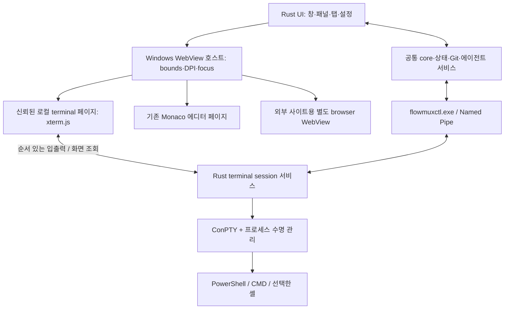

<!-- SPDX-License-Identifier: GPL-3.0-or-later -->

# Windows 설치형 flowmux: 터미널 WebView 전환의 기능별 타당성 검토

검토일: 2026-09-27. 코드 기준: `91f9a0922736619fca9d514418f77f1d69865981`.

**판단: Rust 앱 안의 터미널 화면을 WebView2 + xterm.js로 구성하는 것은 가능하다. 그러나 터미널 교체만으로 현재 flowmux 전체가 Windows를 지원하지는 않는다.** 한글 입력을 포함한 대부분의 사용자 기능에는 구현 경로가 있다. 까다로운 부분은 네이티브 UI와 WebView의 합성, 실행 중인 탭 이동, 화면 버퍼 기반 기능, Windows 프로세스·셸 연동, SSH 다중화다. 이 항목의 실증 없이 “기존 기능 전부 정상 지원”을 약속할 근거는 없다.

이 문서는 **구현 가능성 검토 결과**다. Windows 버전을 구현하거나 실제 Windows IME 시험을 완료했다는 보고가 아니다. 확인한 빌드 환경은 Rust 1.95.0의 `x86_64-unknown-linux-gnu`이며 설치된 Rust target도 해당 Linux target뿐이다. 현재 저장소에는 Windows 터미널/WebView 백엔드 및 Windows 배포·CI가 없다. Windows 실기 결과가 필요한 항목에는 아래 통과 조건을 명시했다. 기존 Linux 테스트 결과를 Windows 지원 증거로 사용하지 않았다.

## 1. 검토 범위와 근거

검토 대상은 다음 구성이다.

- 창, side panel, workspace, pane, tab, 메뉴, 설정, 파일·Git·에이전트 관리: Rust가 제어하는 데스크톱 UI/로직.
- **새로 웹화하는 부분:** 터미널의 문자·커서·선택·스크롤·조합 입력 표시.
- 실제 셸·프로세스: Windows에서 Rust 백엔드가 ConPTY로 실행. 기본 지원에 WSL이 필요하지 않음.
- 기존 브라우저와 Monaco 에디터는 이미 WebView 기반이다. 이들을 Rust 문자 렌더러로 다시 만드는 것은 범위에 포함하지 않는다. Windows에서는 해당 WebView 호스트도 이식해야 한다.
- 전체 앱 화면을 React/Tauri 프런트엔드로 재작성하는 것은 별도 선택지이며, 이번 권고의 전제가 아니다.

README와 설정·키보드·SSH·에이전트 세션 사용자 문서, `Request` 62개, `GtkCommand` 93개, 최상위 CLI `Cmd` 53개, `BrowserOp` 30개, `ActionId` 37개, 설정 24개 필드, 에디터 양방향 메시지 39개, 주요 구현 파일을 대조했다. 부록에 코드의 명령 열거형을 다시 목록화하여 GUI 기능과 CLI 기능의 누락을 점검한다. 명령의 존재 자체가 정상 구현의 증거는 아니다. 쿠키 가져오기처럼 현재 placeholder인 경로도 구분했다.

주요 현행 근거:

- [현재 플랫폼 범위](setup.md), [기능 소개](../README.md), [설정](configuration.md), [키 동작](keybindings.md), [SSH 범위](ssh-workspaces.md), [세션 범위](agent-sessions.md).
- [GTK/VTE 의존성](../crates/flowmux/Cargo.toml), [PaneTerminal 타입 별칭](../crates/flowmux/src/ui/pane_terminal.rs), [실제 VTE 구현](../crates/flowmux/src/ui/ghostty_pane.rs).
- [GUI 명령 연결](../crates/flowmux/src/bridge/mod.rs), [headless handler](../crates/flowmux-daemon/src/handler.rs), [IPC 규약](../crates/flowmux-ipc/src/protocol.rs).

표의 **중**은 연결 코드·OS별 처리가 필요하다는 뜻이고, **높음**은 주요 하위 시스템 재설계 또는 실제 통합 실험이 필요하다는 뜻이다. **조건부**는 외부 프로그램·OS·인증·프로토콜 조건 때문에 flowmux만 수정해서 동일성을 보장할 수 없음을 뜻한다. 난도는 작업시간 추정이나 완료율이 아니다. 모든 “가능” 판정은 구현 경로에 대한 판단이다.

## 2. 구조 선택: Rust 유지와 GTK 유지의 차이

Rust는 구현 언어이고 GTK/VTE/WebView는 플랫폼 의존 계층이다. `PaneTerminal = GhosttyPane`는 교체 가능한 backend trait가 아니다. `.widget`, GTK 이벤트, VTE 검색·버퍼 API를 호출하는 소비자들도 변경해야 한다. `flowmux-daemon` 또한 그대로 완성된 서버가 되지 않는다. 현재 headless handler는 터미널 생성·브라우저·일부 pane 조작을 GUI에 위임하거나 `Unimplemented`로 응답한다.

| 구조 | 요청과의 적합성 | 장점 | 해결해야 할 점 | 판정 |
|---|---|---|---|---|
| GTK4/libadwaita Rust UI 유지 + Windows WebView2 child view | 가장 많은 기존 UI 코드를 유지 | side panel·설정·파일·알림 UI 재사용 여지 | GTK/native HWND 연결, popup 겹침, 좌표·DPI, 포커스, COM 메시지 루프, GTK 배포·링크 조합 | 먼저 검증할 후보. 자동 호환으로 간주하지 않음 |
| Windows용 Rust UI 호스트 + WebView2 또는 Wry child view | 나머지 화면도 Rust가 구성한다는 조건 충족 | Windows 창·입력·배포를 직접 설계 | GTK widget 코드는 상당 부분 다시 작성. Rust 상태/서비스 위주 재사용 | 첫 후보 실패 시 유효한 대안. 별도 프런트엔드 개발 규모 |
| Tauri 일반 구성으로 전체 UI 웹화 | 이번의 “터미널 부분만 웹” 범위와 다름 | 웹 레이아웃에서 terminal/editor 통합 편리 | 기존 GTK UI 재작성 필요 | 이전 대화의 제안과 이번 구조를 구분할 것 |

GTK4는 Win32 backend를 제공하므로 “GTK라 Windows에서 불가능”이라는 판정도 잘못이다. 다만 GTK의 Windows 지원이 현재 앱의 VTE·WebKitGTK·libadwaita·배포 전체를 보증하지는 않는다. [GTK Windows 문서][W1]

Wry에는 Windows 자식 창으로 WebView를 만드는 API가 있다. 이것은 GTK4 widget으로 곧바로 삽입된다는 의미가 아니다. 조사한 Wry 0.57.0의 Unix `build_gtk`는 GTK 0.18/WebKit2GTK 계열이고, 현 flowmux는 GTK4/WebKitGTK 6 계열이다. Windows 전용 연결과 Linux 기존 backend를 분리하는 편이 타당하다. [Wry child view][W2], [Wry 의존성][W3]

권고 구조는 다음과 같다. 실제 GUI toolkit 선택은 첫 번째 실증 단계의 결과로 확정한다.

WebView2 객체는 UI STA thread와 메시지 루프에서 다룬다. PTY 읽기·쓰기, 파일 검색, 사용량 조회는 worker에서 수행하고 UI 명령을 전달한다. UI thread에서 WebView 응답을 동기 대기하면 deadlock/reentrancy 문제가 생길 수 있다. [WebView2 threading][W4]

외부 browser WebView에는 terminal/editor가 쓰는 로컬 파일·셸 실행 권한을 주지 않는다. 이 경계는 flowmux처럼 외부 웹페이지와 로컬 실행 기능을 같은 창에 넣는 구조의 필수 요소다. [WebView2 메시지 경계][W5]

## 3. 한글: 구현 가능하지만 가장 먼저 실기 검증할 영역

후속 [한글 입력 사전 검토](korean-input-audit-2026-09-27.md)에서 현행 동작 54개 항목과 실제 IBus 입력 48개 사례를 대조했다. WSL 기본 우회 경로의 Backspace는 자모 분해가 아닌 확정 후 DEL이며, 조합 중 Shift+방향키와 강제 동기 IBus의 일부 혼합 입력에서 순서 문제가 재현됐다. 아래 I01–I12는 새 구현의 합격 기준이며, 현행 모든 경로의 통과 선언이 아니다.

현재 VTE 경로는 숨겨진 커서에서 preedit를 다시 그리기 위한 보완, IMContext focus 왕복, 조합 완료와 Enter 순서 보정, 선택적 IBus 우회 코드가 있다. Windows WebView 경로에서는 이 GTK/IBus 코드를 재사용하지 않는다. WebView의 입력 요소와 xterm.js composition 처리에 Windows IME를 연결한다. 기존 코드의 `CLAUDE_CODE_NATIVE_CURSOR=1`도 새 backend에서 필요한지 다시 판단해야 한다.

xterm.js에는 composition 이벤트·조합 표시·확정 입력 처리 및 한글 종성 이동을 고려하는 코드가 존재한다. 이것은 구현 가능성을 뒷받침한다. 특정 안정 버전 + WebView2 + Microsoft IME + 대상 TUI 조합의 무결함을 증명하지는 않는다. 조사한 upstream 소스와 실제 도입 버전은 구분하고, 도입 시 버전을 고정한다. [xterm composition 소스][W6]

| ID | 세부 기능 | 판정/난도 | 구현 및 필수 통과 조건 |
|---|---|---|---|
| I01 | 한글 완성형 표시·붙여넣기 | 가능/중 | ConPTY UTF-8 스트림을 바이트 경계와 무관하게 처리. `한글ABC🙂`가 chunk 중간에서 잘려도 U+FFFD나 누락이 없어야 함 |
| I02 | `ㅎ → 하 → 한` 조합 중 표시 | 가능/높음 | native IME → WebView input → composition UI 경로. 조합 중 글자가 커서 옆에 보여야 하며 확정 전에 셸에 중복 전달하지 않음 |
| I03 | 종성 이동·연속 타이핑 | 가능/높음 | `가나`, `한글`, 빠른 받침 이동에서 중복 음절/유실 없음. 키마다 Rust가 별도로 문자를 생성하지 않음 |
| I04 | 조합 중 Backspace | 가능/높음 | `한 → 하 → ㅎ → 빈 조합`처럼 IME가 관리하는 삭제를 전달. DEL을 먼저 셸에 보내 이전 확정 글자를 지우지 않음 |
| I05 | 조합 직후 Enter | 가능/높음 | 최종 음절이 전송된 뒤 제출 이벤트 1회. `안녕하세요` 마지막 `요` 누락·Enter 이중 전송 없음 |
| I06 | Shift+Enter 줄바꿈 | 가능/높음 | 현재 약속인 조합 확정 후 `ESC CR` 순서를 보존. 새 keyboard protocol을 쓰는 TUI와 구분하여 시험; 모든 키를 한 프로토콜로 강제하지 않음 |
| I07 | 한/영·한자 키, 후보 선택 | 가능/높음 | Windows IME가 키를 소유. 후보창 위치/선택, Esc 취소, 우측 Alt/언어별 배열을 native 가속키가 가로채지 않음 |
| I08 | TUI가 커서를 숨긴 상태의 한글 | 가능/높음 | `?25l`, alternate screen, agent 자체 커서에서도 preedit와 후보창 확인. VTE workaround 제거만으로 해결됐다고 판정하지 않음 |
| I09 | 조합 중 탭·pane·창 이동 | 가능/높음 | 확정/취소 정책을 명시. 이전 tab 문자가 새 tab에 들어가지 않고 focus report도 실제 focus 변화만 전달 |
| I10 | 한글 폭·자모·이모지·복사 | 조건부/높음 | 폰트 fallback, 셸/TUI와 Unicode cell 폭 일치. NFC/NFD 원문을 임의 정규화하지 않으며 조합형 자모·결합문자도 검색/복사 검증 |
| I11 | DPI·줌·다중 모니터 | 가능/높음 | 100/125/150/200% 배율과 모니터 이동 후 후보창·커서·선택 좌표 일치. 글꼴 로딩 완료 후 cell 측정 |
| I12 | 에디터·검색창·이름 변경의 한글 | 가능/중~높음 | terminal만 통과해도 충분하지 않음. Monaco, Rust/GTK entry, command palette, file rename에서 한글 확정·단축키 충돌 검사 |

ConPTY의 전달 인코딩은 UTF-8이다. 그러나 Windows 프로그램의 원래 code page나 프로그램 내부 문자 폭 문제까지 자동으로 수정하지는 않는다. PowerShell 7, Windows PowerShell 5.1, CMD, 선택적 Git Bash와 native agent TUI를 구별해 검증해야 한다. [ConPTY 개념][W7]

## 4. 터미널 기능

현행 근거: [VTE pane](../crates/flowmux/src/ui/ghostty_pane.rs), [PTY](../crates/flowmux-terminal/src/pty.rs), [입력 mode 추적](../crates/flowmux-terminal/src/key_modes.rs), [미니맵](../crates/flowmux/src/ui/terminal_minimap.rs), [스타일 scrollback](../crates/flowmux/src/ui/terminal_scrollback.rs), [전체 출력 검색](../crates/flowmux/src/ui/window/terminal_output_search.rs), [OSC](../crates/flowmux-notify/src/osc.rs).

xterm.js는 화면 buffer, 선택, scrolling, 입력, 제목, parser 연결을 제공한다. 애플리케이션 전체 출력 검색·flowmux 미니맵·세션 관리는 이 API 위에 구현해야 한다. [Terminal API][W8], [Buffer API][W9], [Parser API][W10]

| ID | 세부 기능 | 판정/난도 | 필요한 변경·검증 |
|---|---|---|---|
| T01 | 기본 셸·tab별 셸·작업 디렉터리 | 가능/높음 | `forkpty` 대신 ConPTY. PowerShell/CMD 탐색, PATH/PATHEXT, 환경 전달, spawn 실패 fallback 구현 |
| T02 | ANSI 색·truecolor·커서·화면 지우기 | 가능/중 | 실제 사용 VT sequence를 지원표와 replay corpus로 비교. 제목만 xterm/kitty로 선언해 기능을 가정하지 않음 |
| T03 | alternate screen·application cursor·mouse TUI | 가능/높음 | 현재 input mode rewrite를 xterm 처리와 중복 적용하지 않음. vim/tig/agent의 진입·복귀·마우스/휠 확인 |
| T04 | Ctrl+C·Ctrl+D·Ctrl+Z·프로세스 종료 | 조건부/높음 | 셸과 앱의 의미 차이를 유지. Ctrl+C 입력과 pane 강제 종료를 분리하고 종료 코드/자손 정리 확인 |
| T05 | 대량 출력·다중 agent 반응성 | 가능/높음 | byte chunk 전송·처리 ACK·유한 queue와 역압. 입력 채널이 출력에 밀리지 않게 설계; 문자마다 JSON/eval 호출 금지 |
| T06 | 셀 크기·창 resize·줄 재배치 | 가능/높음 | 실제 cell 크기 → cols/rows → ConPTY resize. `windowsPty` 정보를 실제 backend/build에 맞춤; resize 중 입력·한글 긴 줄 검증 |
| T07 | scrollback 용량·일반 scrollbar | 가능/중 | 현재 기본 5,000행, 설정 1,000~1,000,000행 범위를 처리. 최대치에서는 여러 tab의 메모리 사용을 실측 |
| T08 | 선택·더블클릭·복사·붙여넣기 | 가능/중 | xterm 선택과 Windows clipboard 연결. 출력 repaint 중 선택 보존, 줄바꿈·한글·다중 행 확인 |
| T09 | bracketed paste | 가능/중 | `paste()`와 mode를 이용, 앱이 요청한 bracketed paste만 전송. 일반 입력과 paste를 중복 전달하지 않음 |
| T10 | 단일 터미널 찾기 | 가능/중 | Search addon 또는 buffer 검색. 현행 검색 UI의 대소문자/표현식 동작과 다음·이전·wrap 의미를 맞춤 |
| T11 | 모든 터미널 출력 검색 | 가능/높음 | 숨은 tab/SSH 포함, retained history, 긴 soft-wrap 줄, 500행씩 결과, 클릭 이동·강조, 결과 stale 판단·취소 보존 |
| T12 | `read-screen` / `capture-pane` | 가능/높음 | stdout transcript가 아닌 **VT 처리 후 현재 viewport** 조회. 지정 surface의 처리 완료 sequence까지 기다려 일관된 읽기 제공 |
| T13 | 상태 감지용 최근 화면 추출 | 가능/높음 | normal buffer 최근 행과 alternate 현재 화면 분리. 매 출력마다 전체 scrollback을 Rust로 복사하지 않음 |
| T14 | 터미널 미니맵 | 가능/높음 | xterm 기본 기능으로 동일 미니맵이 생기지 않음. cell 색·폭을 읽어 canvas/네이티브 raster로 구현. hover scroll과 viewport 이동 분리 |
| T15 | 미니맵 크기·투명도·alternate 전환 | 가능/높음 | 현재 width 12~96, opacity 0~100와 실시간 설정 반영. gutter 변화로 TUI 열 수가 왕복하지 않도록 설계 |
| T16 | 스타일 scrollback 저장·복원 | 가능/높음 | VTE HTML ↔ 공통 styled cell/run 또는 검증된 직렬화 형식 변환. 기존 256 KiB 저장 한도·옛 state 호환 보존 |
| T17 | URL·OSC 8·이미지/Markdown 경로 클릭 | 가능/중 | link provider/parser와 Rust opener 연결. `C:\…`, UNC, 한글·공백 경로를 처리하고 원격 경로를 로컬로 오인하지 않음 |
| T18 | cwd/제목·새 tab 위치 상속 | 조건부/높음 | OSC 7·0/2 + PowerShell prompt integration. `/proc/<pid>/cwd`를 동일하게 사용 불가; 신뢰 가능한 cwd 증거와 모름 상태를 분리 |
| T19 | OSC 9/99/777 알림·출력 활동 | 가능/높음 | 기존 Rust parser 재사용. ConPTY를 거친 수신 바이트에도 필요한 OSC가 도달하는지 native 실행 경로별 확인; hook과 중복 알림 방지 |
| T20 | 폰트·테마·줌·커서 점멸 | 가능/중 | theme/font 설정을 xterm 옵션에 매핑. point↔CSS px를 명시. 현재 VTE의 blink interval 인수는 무시되므로 정확한 ms 주기 지원을 현행 보장으로 간주하지 않음 |
| T21 | focus reporting·키 반복·named key | 가능/높음 | `send-key`와 물리 입력을 일관되게 인코딩. IME 내부 처리가 focus-out/in 바이트를 유발하지 않아야 함 |
| T22 | 동기화 출력·고급 keyboard protocol | 조건부/높음 | 정확한 도입 xterm/ConPTY/agent 버전에서 capability query와 화면 시험. 문서에 없는 지원을 가정하지 않음; 기존 VTE에도 남은 제한이 있음 |
| T23 | pane 닫기·child exit·GPU/WebView 장애 | 가능/높음 | Rust가 PTY 수명을 소유. 닫을 때 정상 종료→기한 있는 회수, view 재생성과 process 종료 구분. WebGL 실패 시 선택 버전의 fallback renderer 검증 |
| T24 | 접근성·키보드만으로 조작 | 가능/높음 | xterm screen reader 설정과 native UI 접근성 트리의 연결. Narrator에서 pane 이름·출력·포커스·검색 결과 이동 확인 |

ConPTY I/O와 종료 처리에서는 양방향 pipe를 독립적으로 배수하고, 닫기 중 출력 때문에 교착하지 않도록 해야 한다. process group/SIGHUP/SIGKILL 동작을 그대로 이식하지 말고 Windows process handle 및 Job Object 정책을 설계한다. [ConPTY 세션 수명][W11], [Job Objects][W12]

성능은 구조만으로 결론 내릴 수 없다. xterm 공식 안내도 빠른 출력에 flow control이 필요함을 설명한다. WebView별 메모리·GPU 비용이 추가되며, 여러 WebView의 프로세스 공유 관계도 설정과 사이트에 따라 달라진다. “pane마다 별도 전체 브라우저 프로세스 하나” 또는 “모두 단일 process라 비용 없음”이라고 가정하면 안 된다. [출력 제어][W13], [WebView2 process model][W14]

`windowsPty`의 resize/reflow 보정과 scrollback·접근성 옵션은 도입 버전의 실제 옵션을 기준으로 설정한다. 터미널 escape 지원표와 같은 프로젝트의 최신 소스라도 안정 배포 버전과 다를 수 있다. [xterm 옵션][W19], [VT 지원표][W20]

## 5. Rust UI, 레이아웃, 상태

현행 근거: [workspace view](../crates/flowmux/src/ui/workspace_view.rs), [surface 이동](../crates/flowmux/src/ui/window/surface_ops.rs), [overview](../crates/flowmux/src/ui/window/workspace_overview.rs), [side panel](../crates/flowmux/src/ui/sidebar.rs), [설정](../crates/flowmux-config/src/options.rs), [저장 상태](../crates/flowmux-state/src/lib.rs).

| ID | 세부 기능 | 판정/난도 | 필요한 변경·검증 |
|---|---|---|---|
| U01 | workspace 생성·이름·색·순서·닫기 | 가능/중 | core/state 전이 재사용. 선택 workspace, 전체 닫기 확인, 마지막 pane 보호 유지 |
| U02 | 가로·세로 중첩 split·경계 resize | 가능/높음 | Rust layout의 pane rect를 child WebView에 반영. 부모 resize와 개별 pane resize를 혼동하지 않음 |
| U03 | tab 생성·focus·이름·닫기·재정렬 | 가능/중~높음 | PaneId/SurfaceId 구별. native tab header와 WebView focus를 하나의 활성 surface 상태에 연결 |
| U04 | pane 방향 이동·zoom/maximize | 가능/높음 | 숨김/복원 후 올바른 rect·focus·터미널 크기. view 숨김은 process 종료가 아님 |
| U05 | tab을 pane/workspace 사이로 이동 | 가능/높음 | PTY와 session ID 유지, WebView 재부모화/재배치. 이동 중 출력 순서·선택·scrollback 보존 |
| U06 | tab을 새 창으로 떼기 | 가능/높음 | 동일 process 내 새 창이면 parent HWND 변경을 검토. 별도 process 창이라면 session 재연결·소유권 전달 프로토콜 필요; 셸 재시작은 동등 동작이 아님 |
| U07 | workspace overview | 가능/높음 | native overview가 WebView에 가려지지 않도록 live view visibility 또는 검증된 snapshot 합성. 복귀 후 원래 tab·focus 보존 |
| U08 | 메뉴·popover·dialog·drag preview | 가능/높음 | HWND child view의 z-order/clip 문제 실증. 메뉴를 WebView 위에 올리는 것, view 숨긴 뒤 복귀의 IME 영향 포함 |
| U09 | 키 재설정·37개 ActionId·편집기 우선순위 | 가능/높음 | GTK accelerator 문자열의 Windows 해석, Ctrl/Alt/Shift 및 AltGr 충돌 처리. 1회 실행과 terminal/editor/browser 별 우선순위 보존 |
| U10 | 옵션·테마·font·zoom 실시간 반영 | 가능/중 | Rust config source 유지. terminal/browser 공통 zoom과 editor별 zoom 구분, focus border 및 panel 설정 유지 |
| U11 | `cmux.json` 프로젝트 명령 | 가능/중~높음 | 현재 cwd 한 곳만 탐색, argv·env·cwd·confirm·target 유지. 사용자가 적은 `sh -lc`는 자동 PowerShell 번역 대상이 아님 |
| U12 | 재시작 후 layout·scrollback·agent 복원 | 가능/높음 | UI layout, 화면 history, agent resume를 독립 복원. 임의 process 메모리 재개와 혼동하지 않음 |
| U13 | 여러 창의 상태 공유·락·소유권 | 가능/높음 | JSON 모델/`fs2` 락 재사용 가능성 확인. Windows 파일 공유·rename 실패·PID 재사용과 창별 IPC endpoint 검사 |
| U14 | 알림 bell·활동 표시·usage bar·panel 전환 | 가능/중 | Rust state/presenter 추출. native UI 구현에서 표시 대상·읽음 상태·focus 이동의 기존 의미 보존 |

WebView2 controller에는 bounds, parent window, focus 관련 API가 있다. API 존재는 탭 이동 경로의 출발점이고, GTK popup 합성·다중 창 및 IME의 완전한 해결을 뜻하지 않는다. [Controller API][W15]

## 6. 브라우저와 자동화

현행 근거: [browser controller](../crates/flowmux-browser/src/controller.rs), [Linux browser 구현](../crates/flowmux/src/ui/browser_pane_webkit.rs), [Windows 등이 쓰는 현재 stub](../crates/flowmux/src/ui/browser_pane_stub.rs), [browser 명령](../crates/flowmux/src/ui/window/browser_commands.rs), [bookmarks](../crates/flowmux-browser/src/bookmarks.rs), [downloads](../crates/flowmux/src/ui/browser_downloads.rs).

WebView2 API는 navigation, script 실행, messaging, profile, screenshot, downloads 등 구현에 필요한 기반을 제공한다. 아래 “가능”은 해당 API를 기존 flowmux 규약에 연결한다는 설계 판단이다. WebKit과 Chromium의 DOM·미디어·이벤트 차이에 대한 동작 시험은 별도다. [WebView2 API 개요][W16]

| ID | 세부 기능 | 판정/난도 | 필요한 변경·검증 |
|---|---|---|---|
| B01 | browser tab 열기·right sibling 재사용·split | 가능/중~높음 | 기존 배치 모델과 SurfaceId 유지, `about:blank` 초기 상태 및 비동기 navigation 처리 |
| B02 | 주소·title·back/forward/reload/stop·zoom | 가능/중 | navigation 상태와 native chrome 연결. 닫힌 tab/취소된 navigation callback 무시 |
| B03 | DOM snapshot·refs | 가능/중 | 기존 JS와 ref store 재사용. ref scope는 surface별이며 새 snapshot/navigation 뒤 재발급. DOM에 ref attribute를 추가하지 않음 |
| B04 | click/dblclick/hover/focus/blur/scroll | 가능/중~높음 | 기존 DOM 기반 의미 보존. script 이벤트와 trusted OS input 차이를 문서화하고 시험 |
| B05 | fill/select/type/press/check/uncheck | 가능/중~높음 | input/change 이벤트·active element·checkbox/radio 의미 보존. native 키 주입이 필요한 경우 집중 focus/IME 경로와 분리 |
| B06 | text/value/attr/count·상태 조회·eval | 가능/중 | JS 반환값의 문자열/JSON/boolean/null/error 변환 일관화. synchronous modal callback 대기 금지 |
| B07 | selector/text/url/ready-state/JS wait | 가능/중 | 현재 timeout/poll 의미 유지. 이동/닫기/오류 시 성공 오인 금지 |
| B08 | visible viewport PNG screenshot | 가능/중 | WebView2 캡처와 Windows 파일 저장. DPI·숨은 view·페이지 준비 상태 확인 |
| B09 | session 지속/비지속·profile·북마크 | 가능/중~높음 | profile별 user-data folder/비지속 정책 구현. Linux WebKit cookie DB를 Edge DB로 직접 복사하지 않음; 초기 로그인 재수립 필요 |
| B10 | 다운로드·취소·파일명 충돌 | 가능/중 | Windows Downloads 위치, 진행/완료/실패 UI, 경로 정규화와 예약 파일명 처리 |
| B11 | 페이지 찾기·새 창/탭·DevTools·사이트 권한 | 가능/중~높음 | 대상 WebView2 버전 API와 fallback 선정. 카메라·마이크·화면공유·파일 선택 및 native dialog focus 검사 |
| B12 | 미디어·fullscreen·웹앱 로그인 | 조건부/높음 | Chromium 엔진·codec·provider 정책에 따른 차이. 기존 WebKit도 모든 사이트 동작을 보장하지 않으며 대표 사이트 실기 비교 필요 |
| B13 | 호스트 브라우저 쿠키 import | 현행 미완성 | 현재 `InjectCookies` 최종 함수는 metadata를 세고 반환하는 placeholder. Chromium 암호화 값도 미지원. Windows 이식 완료 기준에 기존 완성 기능으로 넣지 않음 |
| B14 | viewport/network-mock/screencast | 현행 미지원 | 현재 capabilities에서 명시적으로 미지원. WebView2에 CDP 관련 API가 있어도 자동 노출하지 않음. 구현한다면 별도 추가 기능 |

웹 terminal 페이지 안의 iframe으로 browser pane까지 대신하면 embedding 정책·교차 origin 제한 때문에 기존 자동화를 유지하기 어렵다. 별도 browser WebView를 유지한다. terminal UI의 JS bridge와 외부 페이지의 자동화 script 실행 권한도 분리한다.

## 7. 에디터·파일·Git·뷰어

현행 근거: [Monaco frontend](../editor/flowmux-editor-web/package.json), [document I/O](../crates/flowmux-editor/src/lib.rs), [editor 메시지](../crates/flowmux-editor/src/protocol.rs), [파일 UI 및 작업](../crates/flowmux/src/ui/file_browser.rs), [Git](../crates/flowmux-vcs/src/lib.rs), [worktree](../crates/flowmux-vcs/src/worktree.rs), [이미지](../crates/flowmux/src/ui/image_viewer.rs), [ThorVG 로더](../crates/flowmux/src/ui/thorvg.rs), [Markdown viewer](../crates/flowmux-md-viewer/src/main.rs).

| ID | 세부 기능 | 판정/난도 | 필요한 변경·검증 |
|---|---|---|---|
| F01 | Monaco 편집·syntax·선택·undo/redo·minimap | 가능/중 | 기존 JS/TS bundle 재사용. WebView2 host message, worker와 로컬 asset URL 연결 |
| F02 | 파일 열기·저장·Save As·Save All | 가능/중~높음 | Rust document service 재사용. Windows dialog·path·file sharing·읽기 전용 처리 검증 |
| F03 | UTF-8/BOM·CRLF/LF | 가능/중 | 현재 encoding/line-ending 모델 유지. 한글과 개행이 저장·재열기 후 바뀌지 않음 |
| F04 | 외부 수정·diff·Keep Mine/Reload | 가능/높음 | watcher/폴링 이벤트를 Windows에 맞춤. version 충돌·외부 삭제·잠긴 파일·이름 변경 검사 |
| F05 | dirty close·crash recovery·다중 문서 | 가능/높음 | popup/WebView 메시지 순서 보장. 미저장 확인 전에 surface나 process를 제거하지 않음 |
| F06 | editor find/replace·Quick Open·workspace search | 가능/중 | Rust 검색 재사용, native UI 연결. 취소·stale 결과·대소문자·한글 경로·긴 파일 확인 |
| F07 | 파일 트리·확장·다중 선택·추가 500행 | 가능/중 | 모델 재사용, Windows 경로 식별과 native focus/keyboard 처리 |
| F08 | 파일 복사·잘라내기·붙여넣기·이름 변경 | 가능/높음 | Windows clipboard 파일 형식, 드라이브 간 이동, junction·symlink, 대상 충돌, 취소 구현. `libc::EXDEV` 분기 그대로 사용 불가 |
| F09 | Delete 휴지통·Shift+Delete 영구 삭제 | 가능/높음 | Recycle Bin과 명시적 영구 삭제 확인. POSIX/GIO 동작을 Windows 셸 동작에 매핑 |
| F10 | 외부 앱 열기·Show in folder·경로 복사 | 가능/중 | Explorer/파일 연결 호출. 공백·따옴표·한글 경로를 command 문자열 삽입으로 처리하지 않음 |
| F11 | Git branch·dirty·commit 정보·PR 표시 | 가능/중 | 현재 Git/`gh` 실행 로직의 Windows 실행파일·인증·경로 처리를 확인. 도구 부재 시 기존 unavailable 의미 유지 |
| F12 | worktree 목록·정보·안전/강제 제거 | 가능/높음 | 사용 중인 workspace/cwd 검사, dirty/lock/main worktree 보호. Windows 열린 파일 때문에 제거 실패하면 실제 상태 재조회 |
| F13 | tig 실행 | 조건부/중 | Windows에서 실행 가능한 tig 설치가 전제. flowmux가 Windows에서 실행된다는 사실만으로 tig가 제공되지는 않음 |
| F14 | PNG/JPEG/WebP/GIF·SVG·Lottie viewer | 가능/중~높음 | image crate 로직 및 native UI 이전. ThorVG Windows DLL 빌드/검색/배포 필요; 현재 `.so/.dylib` 후보만 있음 |
| F15 | Markdown preview·저장 시 갱신·font/zoom·링크 | 가능/중~높음 | HTML 생성과 파일 감시는 재사용, Linux WebKit viewer를 Windows WebView2 창으로 연결. 별도 실행파일/파일 연결도 포함 |
| F16 | Markdown `--render-png` 전체 문서 export | 가능/높음 | browser의 viewport screenshot과 별개. 전체 문서 캡처 방법·최대 크기·font 로딩·긴 문서 검증; 단순 viewport 캡처로 대체하지 않음 |
| F17 | Windows 경로·권한·원자적 저장 | 가능/높음 | 드라이브/UNC/긴 경로/대소문자 alias, 읽기 전용·ACL·sharing violation, 임시파일 교체 검사. 단순 `/`→`\` 치환으로 해결 불가 |

현재 기능을 넘겨 추정하지 않는다. worktree 패널의 현재 핵심은 목록·정보·제거이며, Orca의 모든 Git diff/commit UI가 flowmux에 이미 있다는 전제는 두지 않는다. 에디터의 UTF-8/BOM/CRLF 모델이 임의 CP949 파일 변환 지원을 뜻하지도 않는다.

## 8. 에이전트·알림·세션·사용량

현행 근거: [hook 설치](../crates/flowmux-cli/src/hook_install.rs), [hook 처리](../crates/flowmux-cli/src/hooks.rs), [프로세스 식별](../crates/flowmux-procmon/src/lib.rs), [상태 판정](../crates/flowmux/src/activity.rs), [agent session 저장](../crates/flowmux-state/src/agent_sessions.rs), [session history](../crates/flowmux-state/src/session_history.rs), [사용량](../crates/flowmux/src/usage/mod.rs), [desktop 알림](../crates/flowmux-notify/src/sender.rs).

| ID | 세부 기능 | 판정/난도 | 필요한 변경·검증 |
|---|---|---|---|
| A01 | Claude/Codex/OpenCode/Gemini/agy/Cline 실행 | 조건부/중~높음 | 각 CLI의 Windows 배포·셸/런타임 요구사항을 실제 지원 버전별 확인. `.exe/.cmd/.ps1` 경로·인수·한글 cwd를 처리 |
| A02 | working/blocked/done/idle·미확인 완료 표시 | 가능/높음 | core ledger 재사용, hook·process·screen의 증거 우선순위 유지. 화면 title이 authoritative identity를 덮어쓰지 않음 |
| A03 | hook 설치·doctor·fix·uninstall | 가능/높음 | POSIX shell wrapper와 chmod 경로를 Windows launcher/hook handler로 이식. 사용자의 다른 hooks와 신뢰 결정을 보존 |
| A04 | CLI별 lifecycle·permission·child agent 추적 | 조건부/높음 | 기존 event별 상관관계 유지. 한 도구 종료로 병렬 permission 대기가 해제되지 않게 함. 각 native CLI의 Windows hook 발생을 실제 확인 |
| A05 | process 이름·argv·자손·생존 추적 | 가능/높음 | `/proc`·`kill(pid,0)` 대신 process handles/Windows 조회와 launch 정보. arbitrary process의 cwd/env를 항상 얻는다고 가정하지 않음 |
| A06 | screen fallback·숨은 tab 활동 | 가능/높음 | T12/T13과 결합. 숨겼다는 이유로 parser를 정지하면 완료 감지·검색·read-screen 모두 깨질 수 있음 |
| A07 | bell list·desktop toast·click 복귀·배지 | 가능/높음 | bell 상태는 재사용, D-Bus는 Windows toast/activation/작업표시줄 표시로 교체. 창이 여러 개여도 정확한 pane/tab으로 이동 |
| A08 | Claude/Codex session 목록·preview·검색 | 가능/중~높음 | JSONL reader 재사용. Windows 저장 위치·설정 override·중단된 파일 읽기 검증 |
| A09 | OpenCode/Antigravity/Cline native history | 조건부/중~높음 | SQLite/메시지 파서 재사용, Windows 저장 위치·schema 확인. agy 전체 transcript는 현행 지원이 아니며 summary만 제공 |
| A10 | 선택 session을 새 tab에서 resume | 가능/높음 | 5종 agent별 argv/cwd/config 보존. PowerShell/CMD별 quoting으로 원래 busy tab과 draft를 건드리지 않음 |
| A11 | 앱 재시작 시 자동 agent resume | 가능/높음 | 현재 자동 저장 대상은 Claude/Codex/OpenCode/Antigravity 4종. POSIX `shell_command()`를 Windows shell adapter로 이전; Cline의 수동 resume와 구별 |
| A12 | Claude/Codex 사용량·quota UI | 조건부/중~높음 | UI·집계 재사용. Claude credential 경로/OAuth 호출, Codex `app-server` 실행과 응답 버전을 확인. 인증 실패를 0 사용량으로 표시하지 않음 |
| A13 | Claude Teams·tmux compatibility shim | 조건부/높음 | parser/state 재사용, Windows에서 호출 가능한 shim 필요. 실제 Claude가 지원하는 호출 경로·이름·인수·수명까지 검증; 임의 tmux 전체 호환은 현재도 아님 |
| A14 | pane→agent session 이름·메시징 정보 | 조건부/중~높음 | mapping/표시 재사용. Claude 자체 메시징은 외부 CLI 지원에 의존; agent 환경과 세션 이름 변경 후 stale mapping 처리 |

agent가 Windows에서 지원되지 않는 기능을 flowmux의 terminal renderer가 대신 제공하지는 않는다. flowmux 본체에 WSL을 요구하지 않는 것과 모든 외부 CLI가 추가 런타임 없이 작동하는 것은 별도 조건이다. 실제 도입 시 CLI별 버전·설치 형태·hook 지원표를 고정해야 한다. 이 문서에서는 확인하지 않은 native CLI 조합을 “완전 지원”으로 표시하지 않았다.

## 9. SSH workspace

현행 근거: [SSH argv 생성](../crates/flowmux-core/src/ssh.rs), [GUI SSH 수명 및 forward](../crates/flowmux/src/ui/window/ssh.rs), [현재 지원 범위](ssh-workspaces.md).

**SSH는 터미널 웹화와 별개로 재설계 위험이 큰 부분이다.** 현재 코드는 workspace마다 OpenSSH ControlMaster/ControlPath를 만들고 terminal channel과 forward를 해당 master에 연결한다. Win32-OpenSSH의 공식 설계 문서에는 ControlMaster를 위한 ancillary data 지원이 후속 작업으로 설명되어 있고 관련 issue도 열려 있다. 이것만으로 모든 배포 버전을 단정할 수는 없지만, Windows 기본 ssh에서 현 방식을 지원한다고 가정할 근거가 없다. 대상 `ssh.exe`를 고정해 capability를 검증해야 한다. [공식 설계][W17], [관련 issue][W18]

| ID | 세부 기능 | 판정/난도 | 필요한 변경·검증 |
|---|---|---|---|
| S01 | 접속·ssh alias·user/port/key/config | 가능/중~높음 | Windows OpenSSH 실행·설정 위치·key path·known_hosts 연동. 기존 POSIX 원격 shell 전제는 유지 |
| S02 | password·host key·MFA 인증 pane | 가능/높음 | 실제 interactive TTY 연결. UI workspace 생성 성공과 접속 성공을 구분 |
| S03 | 한 workspace 내 연결 공유·여러 terminal | 조건부/높음 | ControlMaster 대체: multiplex 가능한 SSH library 또는 지원 확인한 client. 독립 ssh process만 쓰면 반복 인증/공유 수명 의미가 달라져 동일성 미달 |
| S04 | disconnect/reconnect·상태·일회성 명령 | 가능/높음 | 새 연결 generation, stale callback 무시. 실패 후 명령을 임의 재실행하지 않고 reconnect는 기존 의미 유지 |
| S05 | 원격 tmux session 유지·재접속 | 조건부/중~높음 | tmux는 원격 host에 필요. native Windows 로컬 tmux 설치와 별개. shell quoting과 session명·attach-only 확인 |
| S06 | 명시적 port forward 추가·목록·제거 | 가능/높음 | master control 명령 대체, loopback binding, 포트 할당 경쟁·중복·실패·정리 처리 |
| S07 | forwarded service browser preview·만료 | 가능/높음 | 현재 Linux 제한 분기를 Windows WebView2에 구현. 연결 종료 후 stale port로 다른 서비스가 열리지 않게 binding 검증 |
| S08 | 저장 후 disconnected 복원·원격 기능 경계 | 가능/중 | 자동 접속하지 않는 현행 동작 유지. remote Files/Worktrees/editor I/O·hooks/session history는 현재 미지원 범위 |

SSH library를 선택하면 OpenSSH config, ProxyJump/ProxyCommand, agent/key 지원, MFA 등 해당 라이브러리의 호환 범위도 별도 조사해야 한다. 단순히 “Rust SSH로 교체”만으로 현 client의 설정 해석이 보존되지는 않는다.

## 10. CLI·설치·운영

현행 근거: [CLI](../crates/flowmux-cli/src/main.rs), [Unix IPC](../crates/flowmux-ipc/src/server.rs), [paths](../crates/flowmux-config/src/paths.rs), [업데이트](../crates/flowmux/src/update/install.rs), [배포 workflow](../.github/workflows/release.yml), [Markdown 별도 binary](../crates/flowmux-md-viewer/Cargo.toml).

| ID | 세부 기능 | 판정/난도 | 필요한 변경·검증 |
|---|---|---|---|
| O01 | `flowmux` CLI 위임·`flowmuxctl`·JSON 결과 | 가능/중~높음 | clap/serde 규약 재사용. GUI subsystem exe의 stdout 문제를 고려해 console CLI entrypoint 보장 |
| O02 | CLI↔GUI 통신·다중 창 endpoint | 가능/높음 | Tokio UnixStream/Listener를 Named Pipe 등으로 추상화. 현재 사용자 접근, 창별 라우팅, timeout·재시작 처리 |
| O03 | 환경 context·identify·tree·capabilities | 가능/중 | pane/surface/workspace UUID 유지. `FLOWMUX_SOCKET_PATH` 호환 또는 명시적 endpoint migration; agent를 잘못된 창으로 보내지 않음 |
| O04 | send-keys/send-key/read-screen·pane/tab 제어 | 가능/높음 | Windows CLI에서 원문 문자열/escape와 protocol 인수를 구분. 읽기는 T12의 barrier를 거침 |
| O05 | notify-stream·pty-tee | 가능/높음 | stream OSC parser는 재사용. `forkpty`·signal·poll을 쓰는 proxy는 Windows용으로 대체/통합. CLI 자체의 사용 의미도 유지 |
| O06 | config/state/log/cache·theme import | 가능/중 | Windows Known Folder 계열 정책과 환경 override 지정. 기존 Linux 경로를 무조건 Windows 기본값으로 사용하지 않음 |
| O07 | 설치·업데이트·uninstall·파일 연결 | 가능/높음 | installer, WebView2 runtime, native DLL, CLI PATH, Markdown/image opener. 실행 중 EXE 교체는 updater/재시작 절차 필요 |
| O08 | update banner·버전 조회·실패 복구 | 가능/중~높음 | release 확인 로직 재사용. apt/dpkg/Flatpak/source installer 분기를 Windows 배포 origin별로 구현 |
| O09 | CI·패키지 검증·진단 | 가능/높음 | Windows native build/test 추가. Bash/Xvfb/DBus 기반 GUI 시험을 native Windows 시나리오로 보완; Linux 회귀도 유지 |
| O10 | sleep/resume·화면 잠금·multiwindow 종료 | 가능/높음 | PTY/SSH/renderer/notification 상태 재동기화. pending callback과 process orphan 검사 |
| O11 | browser engine asset·폰트·DLL·라이선스 | 가능/중~높음 | 배포물 dependency/notice 유지. WebView2 runtime 버전과 loader, ThorVG DLL 로딩 및 offline 첫 실행 검증 |

원자적 저장과 `fs2` 같은 일부 구현은 Windows에서도 재사용 가능한 기반이 있다. “Unix 코드가 보인다”는 이유로 모든 파일 I/O를 전부 폐기할 필요는 없다. 반대로 공통 Rust crate라는 이름만으로 Windows에서 컴파일된다고 보아서도 안 된다. 예를 들어 `flowmux-terminal/src/lib.rs`에는 조건 없는 Unix PermissionsExt 사용이 남아 있다.

### crate별 변경 경계

| 코드 영역 | 재사용할 부분 | 분리·변경할 부분 |
|---|---|---|
| `flowmux-core` | ID, pane tree, workspace, notification/agent 모델 | POSIX SSH argv·path 의미를 서비스 adapter로 분리 |
| `flowmux-config` | 옵션 schema, theme, action 이름 | Windows 경로·shell 기본값·키 표기 해석·diagnostics |
| `flowmux-state` | JSON/SQLite/history 파싱·state merge | 파일 교체·소유권 조회·Windows history 위치·POSIX resume command |
| `flowmux-daemon` | StateStore, 일부 request handler와 tmux 상태 전이 | GUI에 남아 있는 실제 session 생성/수명 서비스 추출; D-Bus notifier 의존 분리 |
| `flowmux-ipc` | request/response JSON, tmux 호환 parser | Unix transport와 Windows Named Pipe를 동일 인터페이스로 구현 |
| `flowmux-terminal` | 색·기본 입력 mode 모델, context 데이터 | Unix PTY·fd·chmod·executable 탐색, VTE용 환경값을 backend별로 분리 |
| `flowmux-notify` | OSC stream/parser·notification 데이터 | zbus/GNOME transport를 Windows notifier로 교체 |
| `flowmux-cli` | 명령 구조·출력·일부 hook event 해석 | shell scripts, pty-tee, hook 설치·doctor·desktop install의 OS adapter |
| `flowmux-procmon` | identity 판정의 일부 순수 로직 | procfs·signal 기반 조회를 Windows 방식으로 구현 |
| `flowmux-vcs` | Git 결과 해석·worktree 정책 | Git/gh 탐색·path·실행 환경·Windows 삭제 오류 처리 |
| `flowmux-browser` | DOM scripts, refs, bookmark/profile 모델 | WebView2 controller 구현과 Chromium 반환값 변환 |
| `flowmux-editor` + `editor/flowmux-editor-web` | document/search/recovery와 Monaco frontend | WebView host bridge·path/file sharing·native dialog |
| `flowmux-cookies` | source ID와 cookie 모델 | 현재 미완성 범위를 명시; host login migration은 별도 요구사항 |
| `flowmux` GUI | UI 정책·presenter·일부 GTK widgets | VTE 직접 호출, native child view host, platform services, usage/agent 실행 경로 |
| `flowmux-md-viewer` | Markdown→HTML과 옵션 처리 | Windows viewer host·전체 문서 이미지 export |

공통 service에서 GTK/VTE/zbus/Unix 전용 의존성이 흘러들지 않도록 Cargo target dependency/feature 경계를 정리한다. Windows 빌드는 별도 frontend target으로 시작할 수 있지만, CLI와 headless 경로에도 OS 분기가 필요하다. terminal widget 하나의 feature flag로 전체 workspace가 이식되지는 않는다.

## 11. 중요한 구현 계약

**입력은 한 경로만 소유한다.** Windows/GTK key event → DOM key event → xterm `onData` 경로와 별도의 Rust `send-key` 처리가 동시에 입력을 보내지 않게 한다. IME 조합 중 Backspace/Enter는 IME와 terminal backend의 계약으로 처리하며 일반 global shortcut 필터가 임의 소비하지 않는다.

**Rust가 process를, terminal backend가 해석된 화면을 소유한다.** Rust에는 `TerminalSession`(surface ID, PTY handle, child, output sequence, 종료 상태)을 둔다. 첫 구현은 xterm 화면을 authoritative grid로 삼고 `read_viewport`, `search_history`, `recent_rows`, `snapshot`, `restore`, `scroll_to_match` 등을 backend API로 노출하는 편이 단순하다. raw ANSI transcript를 정규식으로 지워 화면을 만드는 방법은 alternate screen·커서 이동에서 현재 기능과 달라진다.

**화면 조회에는 출력 순서 기준점이 필요하다.** PTY chunk에 증가 sequence를 붙이고, xterm이 해당 chunk를 처리한 뒤 ACK한다. `read-screen`은 호출 시점에 받은 출력의 기준점까지 처리된 grid를 읽는다. 메시지 도착/`write()` 호출만으로 parsing 완료를 가정하지 않는다. viewport와 최근 출력, 전체 history의 의미도 분리한다.

**숨은 tab에서도 필요한 파싱은 살아 있어야 한다.** 화면 그리기 빈도를 줄이는 것과 parser를 멈추는 것은 다르다. WebView 숨김·최소화·OS throttling 상황에서 queue가 증가하면 읽기·검색·상태 감지가 stale해진다. 초기에는 tab의 terminal model을 유지하고, suspend 최적화는 숨은 상태 시나리오 통과 뒤 도입한다. Rust에 두 번째 VT emulator를 도입하는 대안은 cell 폭·escape 처리의 이중 구현 불일치 비용까지 계산해야 한다.

**view 수명과 session 수명을 분리한다.** 닫기는 session 종료지만 tab 이동은 종료가 아니다. 최초 구현은 terminal surface별 view를 유지하는 편이 이동·숨은 parser의 의미를 보존하기 쉽다. 동일 환경/profile의 WebView 공유를 검토하되 memory를 실측한다. view 재생성 시에는 직렬화와 후속 출력 경계를 보존하고, 복원 데이터를 live 프로그램 입력으로 보내지 않는다.

**브라우저·터미널·에디터는 역할을 구분한다.** 외부 사이트에는 셸/파일 bridge가 없어야 한다. 로컬 terminal이 링크를 클릭해 외부 페이지로 바뀌어도 기존 실행 권한을 승계하면 안 된다. backend는 메시지의 surface·origin·수명 세대를 검증한다.

## 12. 실제 Windows에서 통과해야 할 시험

아래는 향후 구현의 수용 기준이며, 이번 조사에서 실행한 시험 결과가 아니다. 숫자는 제안하는 초기 검사 규모이고 성능 측정값이 아니다. 각 시험의 앱 버전, OS build, WebView2 runtime, xterm/addon, 셸/agent 버전, font/DPI를 함께 기록한다.

| Gate | 시험 | 최소 통과 조건 |
|---|---|---|
| G01 | Windows host와 WebView 혼합 UI | GTK 유지 후보에서 split 4개, popup·dialog·overview·새 창 tear-off를 실행. 가림·잘못된 hit-test·focus 유실 없음. 실패 시 native Rust host 경로로 구조 결정 |
| G02 | 한글 IME 전체 | I01~I12. 실제 키보드/IME 입력으로 조합·삭제·Enter·Shift+Enter·후보창·탭 이동 확인. 문자열 `send-keys`/JS fill만으로 합격 처리하지 않음 |
| G03 | PTY lifecycle | 생성/resize/일반 종료/강제 닫기/자손 종료/100회 반복/미완성 spawn 실패. orphan·handle 누수·종료 코드 유실 없음 |
| G04 | VT 및 TUI 호환 | normal/alternate, mouse, colors, cursor, paste, focus, capability reply, 한글 폭. golden screen과 입력 bytes를 확인하고 native agent 사용도 포함 |
| G05 | 출력 부하·background | 1/4/16개 terminal, 대량·간헐 출력, 숨은 tab, 최소화·lock. 입력 지연·CPU·전체 process-tree 메모리·queue 최대치를 측정하고 유한성을 증명 |
| G06 | 화면 소비 기능 | 같은 출력에서 viewport read, 전체 검색, 최근 agent 화면, minimap, 스타일 저장이 일치. 긴 wrap·한글·잘린 history·alternate·취소·stale 결과 포함 |
| G07 | tab 이동·다중 창 | 실행 중인 TUI를 pane/workspace/새 창으로 옮겨 PID/session·출력·scrollback·cwd·IME 타깃을 보존 |
| G08 | 파일·editor·viewer | UTF-8/BOM/CRLF, 한글·공백·UNC·긴 경로, file lock, dirty close, external edit, crash recovery, Recycle Bin, Git worktree 사용 중 보호, Markdown PNG 전체 문서 확인 |
| G09 | 30개 browser 명령 + UI | 고정 fixture로 DOM 불변/ref 만료·form·wait·error·screenshot 검증. profile 지속/비지속·download·권한·새 창·검색은 실제 view에서도 검사 |
| G10 | 모든 agent 통합 | 6종 launch/hook 각각, 5종 수동 history/resume, 4종 자동 resume, permission 병렬·child 재사용·중단·세션 종료, 원래 draft 보존. 이용 불가한 외부 버전은 제한으로 기록 |
| G11 | SSH 계약 | key/password/MFA·여러 terminal 공유·forward add/remove·reconnect·tmux·일회성 명령 비재실행·preview 만료. 반복 인증으로 바뀐 경우 기존 동작과 다르다고 기록 |
| G12 | 실제 설치·업데이트 | 새 Windows 사용자에서 installer부터 실행. WSL 없음, 선택 dependency 없음, WebView2 없음/있음, CLI PATH, 파일 연결, toast click, upgrade/uninstall 후 사용자 데이터 정책 확인 |
| G13 | 기존 플랫폼 회귀 | 공통 model/protocol 변경 뒤 Linux의 현행 UI·CLI·agent·SSH 시험. Windows 조건 분기만으로 기존 동작이 유지된다고 추정하지 않음 |

성능 목표치는 기존 flowmux Linux 측정과 Windows 기준 터미널을 동일 workload로 비교한 후 정한다. 이 단계에서는 근거 없는 “메모리 몇 MB”, “N배 빠름”, “몇 주면 전부 완료” 수치를 제시하지 않는다.

## 13. 구현 순서와 최종 판단

1. **GUI 호스트·IME 실증:** Rust UI + WebView2 + xterm + ConPTY의 작은 창에서 G01~G04를 먼저 확인한다. terminal만 보이는 demo로 native 메뉴/분할/IME 문제를 덮지 않는다.
2. **terminal 서비스 경계 추출:** pane/widget lifetime에서 PTY를 분리하고, byte stream/resize/key/grid/search/snapshot 계약을 정의한다. CLI Named Pipe와 per-window 식별도 이 단계에 넣는다.
3. **터미널 관련 기능 동일성 확보:** 전체 검색·미니맵·숨은 tab·styled restore·tab 이동·한글을 포함해 T/U 항목을 구현한다. 기본 터미널 출력 성공은 이 단계의 완료 기준이 아니다.
4. **browser/editor/file/agent 이식:** 기존 Rust/JS 로직을 Windows adapter에 연결하고 B/F/A 시험을 완료한다. 직접 구현할 수 없는 외부 agent 조건은 버전별로 명시한다.
5. **SSH·설치·업데이트·회귀:** 공유 SSH 수명을 별도 해결하고 S/O 및 G11~G13을 통과한다. 이 단계를 빠뜨린 버전은 전체 기능 호환판으로 배포하지 않는다.

**권고: 이 구조는 채택할 가치가 있다. 먼저 GTK4 유지 + Windows WebView2 삽입을 실증하고, 결과가 좋지 않으면 Windows 전용 Rust UI 호스트를 선택한다.** 한글을 포함한 terminal renderer를 웹으로 구현하는 방향과 나머지를 Rust로 유지하는 방향은 양립한다. 다만 전체 기능 동일성의 비용은 renderer보다 UI 연결·화면 소비 기능·OS 연동·SSH에 더 크게 걸릴 수 있다.

현재 확인한 범위에서는 사용자 기능 대부분에 구현 경로가 있지만, 그대로 재사용 가능한 Windows 완제품은 없다. 특히 **한글 IME, native/WebView 혼합 UI, 실행 중 tab 이동, 숨은 terminal 화면 일관성, SSH 연결 공유, agent의 실제 Windows hook 지원**은 출시 전에 실기로 판정해야 한다. 여기서 제안한 첫 실증은 위험을 판별하는 단계이며 전체 기능 지원 범위를 줄이는 제안이 아니다.

## 14. 외부 근거

모두 2026-09-27에 확인한 공식 프로젝트/API 문서 또는 upstream 소스다. 변경 가능한 `latest`/`master`/`dev` 자료는 구현 시 채택 버전으로 다시 고정해야 한다. 아래 문서는 API 존재·제약의 근거이고, 기능별 난도·구현 순서·gate는 저장소 조사에 기반한 설계 판단이다.

[W1]: https://docs.gtk.org/gtk4/windows.html
[W2]: https://docs.rs/wry/0.57.0/wry/struct.WebViewBuilder.html#method.build_as_child
[W3]: https://github.com/tauri-apps/wry/blob/dev/Cargo.toml
[W4]: https://learn.microsoft.com/en-us/microsoft-edge/webview2/concepts/threading-model
[W5]: https://learn.microsoft.com/en-us/microsoft-edge/webview2/concepts/security
[W6]: https://github.com/xtermjs/xterm.js/blob/master/src/browser/input/CompositionHelper.ts
[W7]: https://learn.microsoft.com/en-us/windows/console/pseudoconsoles
[W8]: https://xtermjs.org/docs/api/terminal/classes/terminal/
[W9]: https://xtermjs.org/docs/api/terminal/interfaces/ibuffer/
[W10]: https://xtermjs.org/docs/api/terminal/interfaces/iparser/
[W11]: https://learn.microsoft.com/en-us/windows/console/creating-a-pseudoconsole-session
[W12]: https://learn.microsoft.com/en-us/windows/win32/procthread/job-objects
[W13]: https://xtermjs.org/docs/guides/flowcontrol/
[W14]: https://learn.microsoft.com/en-us/microsoft-edge/webview2/concepts/process-model
[W15]: https://learn.microsoft.com/en-us/microsoft-edge/webview2/reference/win32/icorewebview2controller
[W16]: https://learn.microsoft.com/en-us/microsoft-edge/webview2/concepts/overview-features-apis

[W17]: https://github.com/PowerShell/Win32-OpenSSH/wiki/About-Win32-OpenSSH-and-Design-Details
[W18]: https://github.com/PowerShell/Win32-OpenSSH/issues/405
[W19]: https://xtermjs.org/docs/api/terminal/interfaces/iterminaloptions/
[W20]: https://xtermjs.org/docs/api/vtfeatures/

## 15. 기능 누락 점검 부록
다음은 기준 commit의 열거형/설정 필드를 구현 검토 행에 대응시킨 목록이다. 원문 코드명을 보존했다. 내부 알림용 명령까지 포함하며, 같은 사용자 기능의 alias나 내부 event는 중복 사용자 기능으로 세지 않는다. 이 대조는 검토 범위 확인이며 runtime 시험이 아니다.
### Request: 62개

| 검토 행 | 코드 항목 |
|---|---|
| S01~S08 | `Ssh` |
| O01~O03 | `Ping`, `WorkspaceList`, `WorkspaceTree`, `WorkspaceCurrent` |
| U01~U06 | `WorkspaceCreate`, `WorkspaceFocus`, `SurfaceCreate`, `PaneSplit`, `PaneFocus`, `PaneResize`, `PaneClose`, `SurfaceFocus`, `SurfaceClose` |
| T12/O04 | `PaneSendKeys`, `PaneReadScreen` |
| T19/A06 | `TerminalOutput` |
| A07/U14 | `Notify`, `NotificationsList`, `NotificationOpen`, `NotificationJumpToUnread`, `NotificationMarkRead`, `NotificationsClear`, `CloseDesktopNotification` |
| B01~B08 | `BrowserOpen`, `BrowserNavigate`, `BrowserBack`, `BrowserForward`, `BrowserReload`, `BrowserUrl`, `BrowserTitle`, `BrowserClick`, `BrowserFill`, `BrowserSelect`, `BrowserScroll`, `BrowserType`, `BrowserPress`, `BrowserText`, `BrowserValue`, `BrowserAttr`, `BrowserWait`, `BrowserScreenshot`, `BrowserDblClick`, `BrowserHover`, `BrowserFocus`, `BrowserBlur`, `BrowserCheck`, `BrowserUncheck`, `BrowserIsVisible`, `BrowserIsEnabled`, `BrowserIsChecked`, `BrowserCount`, `BrowserSnapshot`, `BrowserEval` |
| A02~A11 | `AgentSessionUpdate`, `AgentSessionGet`, `AgentSessionForget`, `AgentActivityUpdate`, `AgentLifecycleUpdate` |
| A13 | `ClaudeTeams`, `TmuxCompat` |
| B13 | `ImportCookies` |

### GtkCommand: 93개

| 검토 행 | 코드 항목 |
|---|---|
| U09~U11 | `ShowOptionsDialog`, `ShowCommandPalette` |
| T11 | `ShowTerminalOutputSearch` |
| U01/U13 | `WorkspaceCreated`, `RefreshWindowTitle`, `NewWorkspace`, `RemoveWorkspace`, `RemoveAllWorkspaces`, `RenameWorkspace`, `SetWorkspaceColor`, `ReorderWorkspace`, `ShowRenameDialog`, `ShowColorDialog`, `FocusWorkspaceDir`, `FocusWorkspaceAt`, `ActivateWorkspace` |
| U02~U08 | `PaneSplitApplied`, `FocusPane`, `TogglePaneZoom`, `ToggleWorkspaceOverview`, `ResizePane`, `SplitFocused`, `CloseFocused`, `FocusDirection`, `NewSurface`, `CreateSurface`, `ActivateSurface`, `CloseSurface`, `RenameSurface`, `ShowRenameSurfaceDialog`, `ReorderSurface`, `TearOffSurface`, `MoveSurfaceToPane`, `MoveSurfaceToWorkspace`, `SplitSurfaceIntoPane`, `PaneFocused` |
| T12/O04 | `PaneSendKeys`, `PaneReadScreen` |
| B01~B12 | `NewBrowserSurface`, `OpenUrlInBrowserTab`, `BrowserUriChanged`, `BrowserTitleChanged`, `BrowserEval`, `BrowserAction`, `BrowserOpenSplit` |
| F07~F10 | `ToggleFileBrowser`, `FileBrowserFocusOut`, `FileBrowserCloseAndRestoreFocus`, `ShowFocusedPaneFolder`, `ShowSurfaceFolder`, `CopySurfaceText`, `CopyFocusedPaneText` |
| F11~F13 | `OpenTig`, `ToggleWorktreePanel`, `RefreshWorktrees`, `WorktreesLoaded`, `ShowWorktreeInfo`, `RemoveWorktree`, `WorktreeRemovalFinished`, `WorktreePanelFocusOut`, `WorktreePanelCloseAndRestoreFocus` |
| F01~F06/F14~F16 | `OpenFileInEditor`, `OpenImageViewer`, `OpenMarkdownViewer` |
| T13/T18/T19 | `TerminalCwdChanged`, `TerminalTitleChanged`, `TerminalContentsChanged`, `TerminalOutputObserved` |
| S01~S08 | `ShowSshDialog`, `Ssh`, `SshCwd`, `SshRefresh` |
| A02/A06/A07/U14 | `AddNotification`, `AddActivity`, `SetUsageBarEnabled`, `SetAgentBarMode`, `OpenActivityTarget`, `SetNotificationDesktopId`, `CloseDesktopNotifications`, `RefreshLauncherBadge`, `OpenNotification`, `ListNotifications`, `OpenNotificationWithAck`, `OpenOldestUnreadNotification`, `MarkNotificationRead`, `ClearNotifications`, `DeleteNotification`, `OpenAgentBarItem`, `ClearAllNotifications`, `SetAgentStatus`, `QueryAgentSurfaceVisible` |
| A08~A10 | `SessionPanel` |
| B13 | `InjectCookies` |

### Cmd: 53개

| 검토 행 | 코드 항목 |
|---|---|
| O01~O03/A14 | `Ping`, `Identify`, `Capabilities`, `SessionName`, `Tree`, `Agents`, `ListPanes` |
| U01~U06/O04 | `Workspace`, `Split`, `SendKeys`, `SendKey`, `ReadScreen`, `CapturePane`, `SelectPane`, `ResizePane`, `FocusPane`, `ClosePane`, `FocusTab`, `CloseTab`, `NewTab` |
| S01~S08 | `Ssh` |
| A07 | `Notify`, `NotifyComplete`, `Notifications` |
| A13 | `TmuxCompat`, `ClaudeTeams` |
| O05/T19 | `NotifyStream`, `PtyTee` |
| B01~B12 | `Browser`, `BrowserSnapshot`, `BrowserEval`, `BrowserNavigate`, `BrowserBack`, `BrowserForward`, `BrowserReload`, `BrowserUrl`, `BrowserTitle`, `BrowserClick`, `BrowserFill`, `BrowserSelect`, `BrowserScroll`, `BrowserType`, `BrowserPress`, `BrowserText`, `BrowserValue`, `BrowserAttr` |
| B13 | `ImportCookies`, `ListBrowsers` |
| U10/O06 | `Theme` |
| A03/O09 | `Agent`, `Hooks`, `Doctor`, `Fix` |

### BrowserOp: 30개

| 검토 행 | 코드 항목 |
|---|---|
| B01 | `Open` |
| B02 | `Navigate`, `Back`, `Forward`, `Reload`, `Url`, `Title` |
| B03 | `Snapshot` |
| B04 | `Click`, `DblClick`, `Hover`, `Focus`, `Blur`, `Scroll` |
| B05 | `Fill`, `Select`, `Type`, `Press`, `Check`, `Uncheck` |
| B06 | `Eval`, `Text`, `Value`, `Attr`, `IsVisible`, `IsEnabled`, `IsChecked`, `Count` |
| B07 | `Wait` |
| B08 | `Screenshot` |

### ActionId: 37개

| 검토 행 | 코드 항목 |
|---|---|
| U02~U04 | `SplitRight`, `SplitDown`, `FocusLeft`, `FocusRight`, `FocusUp`, `FocusDown`, `CloseSurface`, `NextSurface`, `PrevSurface`, `NewSurface`, `TogglePaneZoom` |
| U01/U13 | `QuitApp`, `NextWorkspace`, `PrevWorkspace`, `Workspace1`, `Workspace2`, `Workspace3`, `Workspace4`, `Workspace5`, `Workspace6`, `Workspace7`, `Workspace8`, `NewWorkspace`, `NewWindow` |
| T08/U09/F01 | `Copy`, `Paste` |
| B01 | `NewBrowserSurface` |
| U11 | `CommandPalette` |
| T10/B11/F06 | `TerminalSearch` |
| T11 | `SearchAllTerminals` |
| U07 | `ToggleWorkspaceOverview` |
| F10 | `CopyPanePath` |
| F12 | `ToggleWorktreePanel` |
| F07 | `ToggleFileBrowser` |
| A12 | `ToggleUsagePopover` |
| A08~A10 | `ToggleSessionPanel` |
| F13 | `OpenTig` |

### Options: 24개

| 검토 행 | 코드 항목 |
|---|---|
| U10/T20 | `zoom_percent`, `focus_border_color`, `focus_border_opacity`, `cursor_blink`, `cursor_blink_interval_ms`, `font_family`, `font_size`, `theme`, `theme_overrides` |
| B09 | `default_browser_engine`, `persist_browser_session` |
| A11 | `auto_resume_agent_sessions` |
| T16 | `restore_terminal_scrollback` |
| T07 | `scrollback_lines` |
| T14/T15 | `terminal_minimap_enabled`, `terminal_minimap_width`, `terminal_minimap_opacity` |
| T01 | `default_shell` |
| A07/U14 | `system_notifications_enabled`, `agent_bar_mode`, `agent_notification_target` |
| A12 | `usage_bar_enabled` |
| F01 | `editor_minimap_enabled` |
| U09 | `keybindings` |

### HostMessage: 20개

| 검토 행 | 코드 항목 |
|---|---|
| F01/U10 | `SetAppearance`, `InitializeEditor` |
| F02/F05 | `FlushChanges`, `OpenDocument`, `ReplaceDocument`, `CloseDocument`, `SetActiveDocument`, `SaveCompleted`, `DocumentChangeApplied`, `SaveFailed`, `SaveAsCompleted`, `SaveAsFailed` |
| F04 | `DocumentDiskStatus`, `ShowDiff`, `ConflictActionFailed` |
| F05 | `RecoveryAvailable` |
| F06 | `ShowWorkspaceSearch`, `QuickOpenCompleted`, `WorkspaceSearchCompleted`, `RevealRange` |

### EditorMessage: 19개

| 검토 행 | 코드 항목 |
|---|---|
| F01/U09/U10 | `EditorReady`, `ZoomChanged`, `NativeEditRequested`, `FocusDirectionRequested`, `ActiveDocumentChanged`, `ViewStateChanged` |
| F02/F05 | `DocumentDirty`, `DocumentChanged`, `SaveRequested`, `SaveAsRequested`, `CloseRequested`, `DiscardCloseRequested`, `FlushCompleted` |
| F05 | `RecoveryDecision` |
| F06 | `QuickOpenRequested`, `WorkspaceSearchRequested`, `SearchCancelled`, `SearchResultOpenRequested` |
| F04 | `ConflictActionRequested` |

### SshRequest: 7개

| 검토 행 | 코드 항목 |
|---|---|
| S01~S08 | `Create`, `Connect`, `Disconnect`, `Status`, `ForwardAdd`, `ForwardRemove`, `Preview` |

### SshOp: 7개

| 검토 행 | 코드 항목 |
|---|---|
| S01~S08 | `Host`, `Connect`, `Status`, `Reconnect`, `Disconnect`, `Forward`, `Preview` |

### SshForwardOp: 3개

| 검토 행 | 코드 항목 |
|---|---|
| S06 | `Add`, `List`, `Remove` |

### WorkspaceOp: 4개

| 검토 행 | 코드 항목 |
|---|---|
| U01/O03 | `New`, `Ls`, `Current`, `Focus` |

### NotificationOp: 5개

| 검토 행 | 코드 항목 |
|---|---|
| A07 | `List`, `Open`, `JumpToUnread`, `MarkRead`, `Clear` |

### AgentOp: 3개

| 검토 행 | 코드 항목 |
|---|---|
| A03 | `Install`, `Doctor`, `Uninstall` |

### ThemeOp: 2개

| 검토 행 | 코드 항목 |
|---|---|
| U10/O06 | `Path`, `Import` |

### HooksOp: 9개

| 검토 행 | 코드 항목 |
|---|---|
| A03/A04 | `Setup`, `Uninstall`, `Doctor`, `Claude`, `Codex`, `Opencode`, `Gemini`, `Antigravity`, `Cline` |

### BrowserWaitCondition: 5개

| 검토 행 | 코드 항목 |
|---|---|
| B07 | `Selector`, `Text`, `Url`, `ReadyState`, `Js` |

## 16. 검토 결과의 확인 범위

- 코드 기준 commit과 feature/command inventory를 대조했다. 114개 세부 검토 행과 13개 실기 gate를 작성했다.
- CLI·GUI·browser·editor 메시지 및 설정 필드를 부록의 검토 행에 연결하고, 누락·중복을 기계적으로 검사했다.
- 383개 코드/설정 항목의 대응을 확인했다. 저장소 내부 링크 57개, Markdown 표 구조, feature ID 참조, 외부 근거 참조, whitespace 오류를 검사했다.
- 제품 코드는 수정하지 않았다. Windows 앱 빌드·native IME 입력·성능 측정은 수행하지 않았으며, 실행 결과가 없는 항목의 feasibility와 runtime 지원을 구분했다.
- 앱 내 브라우저로 공식 문서를 열었으나 wait/eval은 `Unsupported result type`으로 실패하여 공식 문서의 내용은 웹 조회 도구로 확인했다. 이 오류를 Windows 지원 조사에서 수정하거나 Windows 결함의 증거로 사용하지 않았다.
